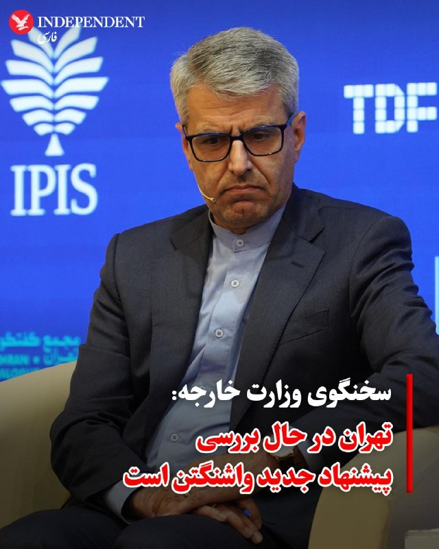
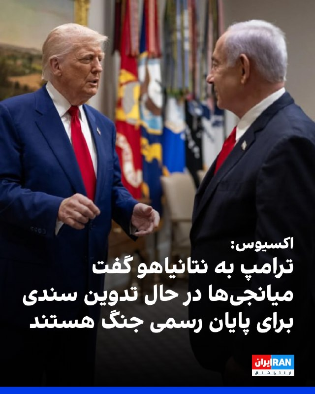
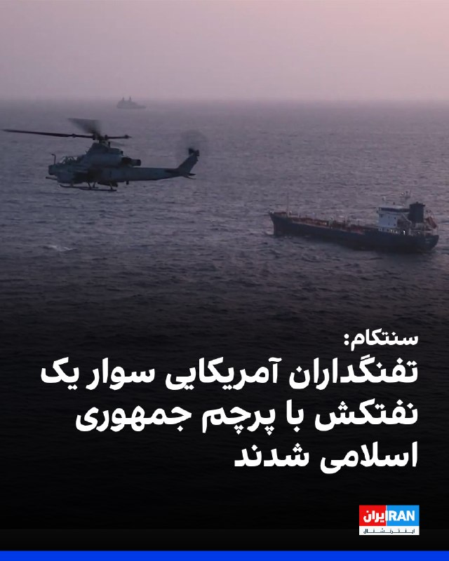
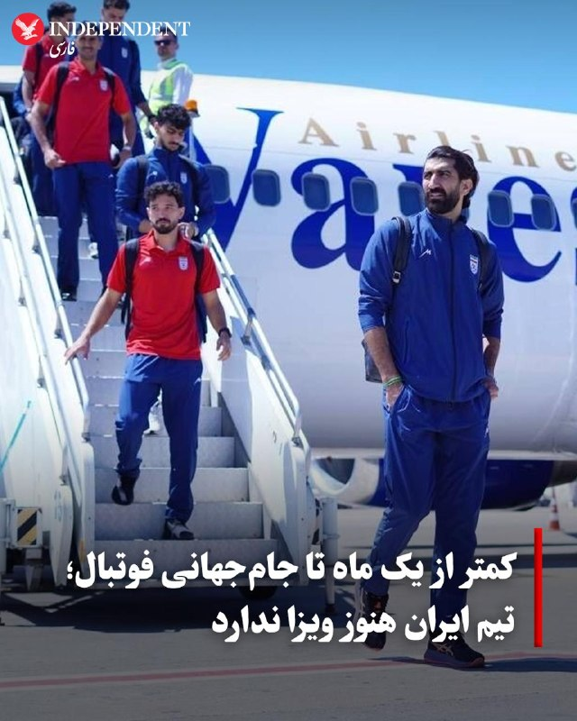
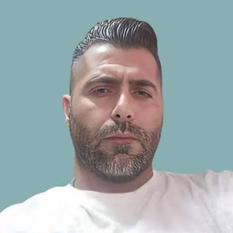
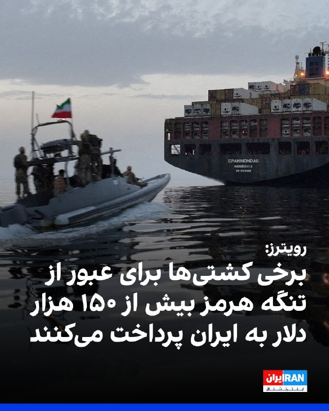
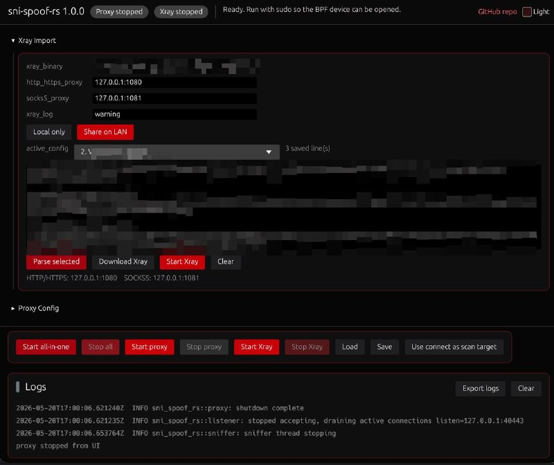
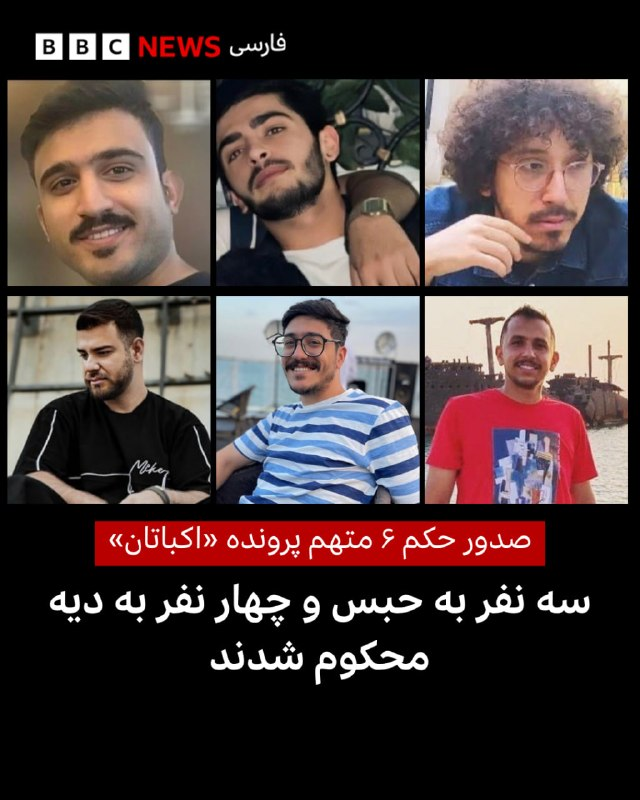

# خواننده تلگرام

<!-- TOP_NAV START -->

<a href="https://github.com/jjjjjjoioapefp/aio-downloader/blob/main/telegram/content/archive_1.md" style="display:inline-block; padding:6px 12px; margin:0 4px; background-color:#2ea44f; color:white; text-decoration:none; border-radius:4px; font-weight:bold;">صفحه بعد</a>

<!-- TOP_NAV END -->

<!-- MSG START -->

---
📅 بروزرسانی: 1405/02/30 22:12
---

## VahidOOnLine — post 241211

  

♦️بر اساس بیانیه نهاد ریاست‌جمهوری ترکیه، رجب طیب اردوغان، رئیس‌جمهوری این کشور، روز چهارشنبه ۳۰ اردیبهشت در تماسی تلفنی با دونالد ترامپ، رئیس‌جمهوری ایالات متحده، از تمدید آتش‌بس میان آمریکا و ایران استقبال و ابراز امیدواری کرد که مسائل مورد اختلاف میان دو طرف قابل حل است.

در بیانیه ریاست‌جمهوری ترکیه آمده است: «رئیس‌جمهوری ما در این گفتگو اظهار داشت که تصمیم برای تمدید آتش‌بس در منطقه درگیری را تحولی مثبت ارزیابی می‌کند و بر این باور است که دست‌یابی به یک راه‌حل منطقی برای مسائل مورد اختلاف امکان‌پذیر است.»
‌🇸🇦 Indypersian

🤖 @VahidOOnLine

## VahidOOnLine — post 241210

♦️ولادیمیر پوتین، رئیس‌جمهوری روسیه، شامگاه چهارشنبه پس از یک سفر دو روزه به پکن و دیدار و گفتگو با شی جین‌پینگ، رئیس‌جمهوری چین، پایتخت این کشور را ترک کرد.
تصاویر منتشرشده، رئیس‌جمهوری روسیه را در حال خداحافظی با هیئت‌های دو کشور، سوار شدن به هواپیما و پرواز از چین نشان می‌دهد.
شی جین‌پینگ و ولادیمیر پوتین در جریان این سفر درباره طیف گسترده‌ای از موضوعات سیاسی، اقتصادی و بین‌المللی گفتگو کردند و دو طرف بر گسترش همکاری‌های راهبردی میان چین و روسیه تاکید داشتند.
رهبران دو کشور که تاکنون بیش از ۴۰ بار با یکدیگر دیدار کرده‌اند، روابط پکن و مسکو را «شراکت راهبردی جامع» توصیف کرده و خواستار تقویت همکاری‌ها در حوزه‌هایی از جمله اقتصاد، انرژی، فناوری، هوش مصنوعی و مسائل امنیتی شدند.
بر اساس بیانیه مشترک منتشرشده، چین و روسیه برنامه‌هایی برای توسعه همکاری‌ها در زمینه‌های مختلف از فناوری‌های نوین و تجارت گرفته تا حفاظت از گونه‌های نادر جانوری مانند ببر، پلنگ و پاندا تدوین کرده‌اند.
در جریان این سفر، شی جین‌پینگ با برگزاری مراسم استقبال رسمی در تالار بزرگ خلق پکن از پوتین استقبال کرد.
‌🇸🇦 Indypersian

🤖 @VahidOOnLine

## VahidOOnLine — post 241209

  

♦️ مسعود پزشکیان، رئیس‌جمهوری اسلامی، روز چهارشنبه ۳۰ اردیبهشت با انتشار پیامی در شبکه اجتماعی ایکس اعلام کرد که تهران «همواره به تعهدات خود پایبند بوده و از هر طریقی برای جلوگیری از جنگ استفاده کرده است».

او نوشت: «از جانب ما همچنان همه راه‌ها باز است.»

پزشکیان در ادامه تاکید کرد: «به زانو درآوردن ایران از طریق اجبار و فشار، چیزی جز یک توهم نیست. احترام متقابل در دیپلماسی، بسیار عاقلانه‌تر، ایمن‌تر و پایدارتر از جنگ است.»

پزشکیان این پیام را ساعتی بعد از دیدار با محسن نقوی، وزیر کشور پاکستان در تهران منتشر کرد. به گفته بقایی، سفر نقوی به ایران در راستای تسهیل تبادل پیام میان تهران و واشنگتن انجام شده است.
‌🇸🇦 Indypersian

🤖 @VahidOOnLine

## VahidOOnLine — post 241208

یک شهروند در پیامی به ایران اینترنشنال از افزایش کالاهای خوراکی روایت کرده و می‌گوید قیمت یک پفک به ۱۸۰ هزار تومان رسیده است. پیام او با هوش مصنوعی خوانده شده است.

Pofak-V.mp4
‌🏁 🇬🇧 IranintlTV

🤖 @VahidOOnLine

## VahidOOnLine — post 241207

  

♦️اسماعیل بقایی، سخنگوی وزارت امور خارجه جمهوری اسلامی، روز چهارشنبه ۳۰ اردیبهشت اعلام کرد که تهران پیشنهاد جدیدی از سوی ایالات متحده دریافت کرده و در حال حاضر مشغول بررسی آن است. این اظهارات همزمان با سفر وزیر کشور پاکستان، به عنوان میانجی، به ایران مطرح شد.

بقایی در مصاحبه تلفنی با صداوسیما گفت: «ما دیدگاه‌های طرف آمریکایی را دریافت کرده‌ایم و در حال حاضر مشغول بررسی آن‌ها هستیم. حضور وزیر کشور پاکستان نیز با هدف تسهیل تبادل پیام‌ها انجام شده است.»

او بار دیگر تاکید کرد که مطالبات جمهوری اسلامی در مذاکرات برای پایان دادن به جنگ، شامل آزادسازی دارایی‌های بلوکه‌شده ایران در خارج از کشور و پایان دادن به محاصره بنادر ایران توسط ایالات متحده است.
‌🇸🇦 Indypersian

🤖 @VahidOOnLine

## VahidOOnLine — post 241206

  

اسماعیل بقایی، سخنگوی وزارت خارجه جمهوری اسلامی، در واکنش به سخنان دونالد ترامپ گفت اولتیماتوم‌ دادن به جمهوری اسلامی «مضحک» است و لفاظی‌ها و تهدیدهای خارجی تاثیری نخواهد داشت. او تاکید کرد جمهوری اسلامی بدون توجه به این اظهارات، منافع خود را دنبال می‌کند.

بقایی آزادسازی اموال بلوکه‌شده را یکی از مطالبات مشخص تهران دانست و افزود در این مرحله تمرکز بر خاتمه جنگ در همه جبهه‌ها، از جمله لبنان است. او هشدار داد در صورت ادامه «زیاده‌خواهی» طرف مقابل، توافقی حاصل نخواهد شد.

سخنگوی وزارت خارجه همچنین گفت تبادل پیام‌ها از طریق وابسته پاکستانی در جریان است و دیدگاه‌های آمریکا دریافت و در حال بررسی است؛ حضور وزیر کشور پاکستان نیز برای تسهیل این روند انجام شده است.
‌🏁 🇬🇧 IranintlTV

🤖 @VahidOOnLine

## VahidOOnLine — post 241205

  

اکسیوس گزارش داد ترامپ و نتانیاهو سه‌شنبه درباره تلاش تازه برای دستیابی به توافق با ایران گفت‌وگو کردند. به گفته یک منبع آمریکایی، ترامپ به نتانیاهو اطلاع داده میانجی‌ها در حال تدوین «تفاهم اولیه» برای پایان رسمی جنگ و آغاز دوره‌ای ۳۰ روزه مذاکرات درباره موضوعاتی از جمله برنامه هسته‌ای ایران و بازگشایی تنگه هرمز هستند.
به نوشته اکسیوس، دو منبع اسرائیلی از اختلاف نظر دو رهبر درباره مسیر پیش رو خبر دادند و یک منبع آمریکایی گفت پس از تماس، «موهای بی‌بی آتش گرفته بود».
این گزارش می‌افزاید پیش‌نویس جداگانه‌ای از سوی قطر وجود ندارد و دو مقام عرب و یک منبع اسرائیلی گفته‌اند قطر پیش‌نویس جدیدی را به تهران و واشینگتن ارائه کرده، اما هنوز مشخص نیست ایران با آن موافقت کند. همچنین به گفته یک مقام عرب، هیأتی قطری برای گفت‌وگو درباره نسخه جدید به تهران سفر کرده است.

‌🏁 🇬🇧 IranintlTV

🤖 @VahidOOnLine

## VahidOOnLine — post 241204

  <a href="telegram/content/VahidOOnLine_241204_1779302545.mp4" target="_blank">🎬 Download video</a>

ویدیوی رسیده به ایران اینترنشنال نشان می‌دهد شهروندان پوستری را در کرج روی دیوار نصب کرده‌اند که با اعتراض به سیاست جنگ‌طلبانه جمهوری اسلامی افزوده تنها جنگ مردم، جنگ برای براندازی رژیم است.
‌🏁 🇬🇧 IranintlTV

🤖 @VahidOOnLine

## VahidOOnLine — post 241203

  <a href="telegram/content/VahidOOnLine_241203_1779302548.mp4" target="_blank">🎬 Download video</a>

وزارت دادگستری آمریکا علیه رائول کاسترو، رئیس‌جمهوری پیشین کوبا و برادر فیدل کاسترو، اعلام جرم کرد.

بر اساس کیفرخواستی که در دادگاه فدرال میامی منتشر شده، رائول کاسترو ۹۴ ساله به همراه پنج نفر دیگر به اتهام قتل، توطئه برای کشتن شهروندان آمریکایی و انهدام هواپیما متهم شده‌اند.

این پرونده به سرنگونی دو هواپیمای متعلق به گروه «برادران نجات» در سال ۱۹۹۶ مربوط می‌شود؛ گروهی از تبعیدیان کوبایی که برای کمک به پناهجویان کوبایی فعالیت می‌کردند. در آن حادثه، چهار نفر کشته شدند.

آمریکا می‌گوید جنگنده‌های کوبایی این هواپیماها را بر فراز آب‌های بین‌المللی هدف قرار داده‌اند، اما دولت کوبا همواره مدعی بوده این هواپیماها وارد حریم هوایی این کشور شده بودند.

این اقدام که بخشی از کارزار فشار دولت ترامپ علیه حکومت کمونیستی کوباست، تنش‌ها میان واشینگتن و هاوانا را به سطح تازه‌ای رسانده است
‌🏁 🇬🇧 ManotoTV

🤖 @VahidOOnLine

## VahidOOnLine — post 241202

  <a href="telegram/content/VahidOOnLine_241202_1779302549.mp4" target="_blank">🎬 Download video</a>

♦️ فرماندهی مرکزی ایالات متحده (سنتکام) روز چهارشنبه ۳۰ اردیبهشت اعلام کرد تفنگداران دریایی آمریکا یک نفتکش تجاری با پرچم ایران در که مشکوک به تلاش برای شکستن محاصره دریایی بود را در دریای عمان توقیف و بازرسی کردند. سنتکام ویدیویی از این عملیات را نیز در شبکه اجتماعی ایکس منتشر کرد.

سنتکام در بیانیه‌ای گفت: «نیروهای آمریکایی پس از بازرسی این شناور و هدایت خدمه آن برای تغییر مسیر، کشتی را آزاد کردند.»

مقامات جمهوری اسلامی هنوز هیچ‌گونه واکنش یا اظهارنظری درباره این حادثه نشان نداده‌اند.

سنتکام در ادامه بیانیه‌ خود افزود که ارتش آمریکا از زمان آغاز اجرای این طرح محاصره دریایی، تاکنون مسیر ۹۱ فروند کشتی تجاری را «تغییر داده است».
‌🇸🇦 Indypersian

🤖 @VahidOOnLine

## VahidOOnLine — post 241201

  <a href="telegram/content/VahidOOnLine_241201_1779302551.mp4" target="_blank">🎬 Download video</a>

⭕️ پزشکیان و وزیر کشور پاکستان در تهران، روند مذاکرات ایران و آمریکا را بررسی کردند

♦️خبرگزاری تسنیم، وابسته به سپاه پاسداران، روز چهارشنبه ۳۰ اردیبهشت گزارش کرد کە مسعود پزشکیان، رئیس‌جمهوری اسلامی در دیدار با سید محسن نقوی، وزیر کشور پاکستان، آخرین تحولات منطقه‌ای، مناسبات دوجانبه تهران و اسلام‌آباد و روند رایزنی‌های دیپلماتیک مرتبط با مذاکرات غیرمستقیم ایران و آمریکا را بررسی کرده است.
در این دیدار، دو طرف درباره روند پیگیری توافقات، تحولات جاری منطقه و اهمیت ادامه مسیر گفتگو و تفاهم تبادل نظر کردند. وزیر کشور پاکستان نیز پیام‌ها و دیدگاه‌های مقام‌های این کشور درباره تحولات منطقه و ضرورت تداوم رایزنی‌های دیپلماتیک را به پزشکیان منتقل کرد.
پزشکیان ضمن قدردانی از «مواضع و همکاری‌های دولت پاکستان در حمایت از ثبات و امنیت منطقه‌ای»، بر اهمیت گسترش روابط دوجانبه و استمرار هماهنگی‌های سیاسی میان تهران و اسلام‌آباد تاکید کرد.
‌🇸🇦 Indypersian

🤖 @VahidOOnLine

## VahidOOnLine — post 241200

  

♦️خبرگزاری تسنیم، وابسته به سپاه پاسداران، روز چهارشنبه ۳۰ اردیبهشت به نقل از اسماعیل بقایی، سخنگوی وزارت امور خارجه جمهوری اسلامی، اطلاعاتی درباره روند مذاکرات میان تهران و واشنگتن را منتشر کرد.

بقایی اعلام کرد که سفر محسن نقوی، وزیر کشور پاکستان به ایران، با هدف «تسهیل تبادل پیام‌ها و ارائه توضیحات تکمیلی برای شفاف‌سازی متن‌های ارسالی میان طرفین» انجام شده است.

رسانه‌های ایران پیش از این گزارش داده بودند که نقوی در چارچوب تلاش‌ها برای دستیابی به توافق میان واشنگتن و تهران، دومین سفر خود را در یک هفته گذشته به ایران انجام داده است. نقوی در این سفر با مسعود پزشکیان نیز دیدار کرد.

بر اساس گزارش تسنیم، بقایی همچنین تاکید کرد که ایران علی‌رغم داشتن «سوءظن شدید و منطقی» به طرف آمریکایی، «مسیر مذاکرات را با جدیت و حسن نیت دنبال می‌کند».
‌🇸🇦 Indypersian

🤖 @VahidOOnLine

## VahidOOnLine — post 241198

⭕️ فوتشال؛ تلفیق فوتبال و شالی‌کاری
شور زندگی در دل شالیزارهای مازندران

♦️همزمان با آغاز فصل نشاکاری برنج در مازندران، کشاورزان و جوانان روستای ریحان‌آباد شهرستان گلوگاه با برگزاری بازی بومی «فوتشال» در شالیزارها، صحنه‌هایی متفاوت و پرنشاط را خلق کردند.
فوتشال که ترکیبی از فوتبال و بازی‌های محلی در زمین‌های گِلی و آب‌گرفته شالیزار است، هر ساله با شروع فصل شالی‌کاری در برخی روستاهای شمال ایران برگزار می‌شود و علاوه بر ایجاد فضایی شاد و صمیمی، بخشی از فرهنگ بومی و سنتی مردم منطقه را به نمایش می‌گذارد.
در این روزها که کشاورزان مشغول نشاکاری و آماده‌سازی زمین‌های برنج هستند، برگزاری چنین آیین‌ها و بازی‌های محلی، حال‌وهوای متفاوتی به شالیزارها می‌بخشد و پیوند دیرینه مردم شمال با کشاورزی و طبیعت را به تصویر می‌کشد.
استان مازندران یکی از قطب‌های اصلی تولید برنج در ایران به شمار می‌رود و با آغاز فصل نشاکاری، هزاران هکتار از شالیزارهای این استان زیر کشت برنج می‌رود.
این تصاویر توسط فرشید سگار ثبت و در خبرگزاری مهر منتشر شده است.
‌🇸🇦 Indypersian

🤖 @VahidOOnLine

## VahidOOnLine — post 241197

  <a href="telegram/content/VahidOOnLine_241197_1779302556.mp4" target="_blank">🎬 Download video</a>

‌
سنتکام، ستاد فرماندهی مرکزی آمریکا، با انتشار ویدیویی اعلام کرد تفنگداران دریایی آمریکا در خلیج عمان یک نفتکش تجاری با پرچم ایران را متوقف و بازرسی کرده‌اند.

به گفته سنتکام، نیروهای «واحد اعزامی سی‌ویک تفنگداران دریایی آمریکا» ساعاتی پیش سوار نفتکش «سلستیال سی» شدند؛ کشتی‌ای که به تلاش برای نقض محاصره دریایی آمریکا و حرکت به‌سوی یکی از بنادر ایران مظنون بوده است.

سنتکام اعلام کرد نیروهای آمریکایی پس از بازرسی کامل نفتکش، به خدمه دستور تغییر مسیر دادند و سپس کشتی را آزاد کردند.

در بیانیه سنتکام آمده است نیروهای آمریکا همچنان «به‌طور کامل» محاصره دریایی را اجرا می‌کنند و تاکنون مسیر ۹۱ کشتی تجاری را برای اطمینان از رعایت این محدودیت‌ها تغییر داده‌اند.
‌🏁 🇬🇧 ManotoTV

🤖 @VahidOOnLine

## VahidOOnLine — post 241196

  

فرماندهی مرکزی آمریکا، سنتکام، اعلام کرد نیروهای تفنگدار دریایی آمریکا از یگان اعزامی ۳۱، چهارشنبه ۳۰ اردیبهشت در دریای عمان سوار نفتکش تجاری «سلستیال سی» با پرچم جمهوری اسلامی شدند.

به نوشته سنتکام، این نفتکش مظنون بود که با حرکت به سوی یکی از بنادر ایران، محاصره دریایی آمریکا را نقض کند. نیروهای آمریکایی پس از بازرسی و دستور به خدمه برای تغییر مسیر، کشتی را آزاد کردند.

سنتکام افزود نیروهای آمریکا به اجرای کامل این محاصره ادامه می‌دهند و تاکنون ۹۱ کشتی تجاری را برای اطمینان از رعایت آن، تغییر مسیر داده‌اند.
‌🏁 🇬🇧 IranintlTV

🤖 @VahidOOnLine

## VahidOOnLine — post 241195

  

♦️ در پی انتشار ویدیویی از بدرفتاری با اعضای ناوگان صمود که برای کمک‌رسانی به نوار غزه، به آب‌های تحت کنترل اسرائیل وارد شده بودند، کشورهای اروپایی و کانادا سفیران اسرائیل را احضار کردند. ایتامار بن‌گویر، وزیر امنیت اسرائیل که خود نیز در این ویدیو در حال خنده و تکان دادن پرچم اسرائیل دیده می‌شود، این تصاویر را با توضیح «به اسرائیل خوش آمدید» منتشر کرد.

وزارت امور خارجه کشورهای کانادا، هلند، ایتالیا، فرانسه و اسپانیا در اعتراض به این اقدام و با خواسته ارائه توضیح، سفیران اسرائیل در این کشورها را احضار کردند. وزارت امور خارجه کشورهای بلژیک، آلمان و بریتانیا نیز ضمن ابراز انزجار از «سوءرفتار» با این کنشگران، خواستار ارائه توضیح از سوی مقام‌های اسرائیل شدند.

گیدئون سعار، وزیر امور خارجه اسرائیل و دفتر نخست‌وزیر این کشور هم اعتراض خود را به رفتار بن‌گویر ابراز کردند. سعار این رفتار را عامل ضربه زدن به وجهه جهانی اسرائیل دانست و دفتر نتانیاهو تاکید کرد که دستور بازگرداندن این افراد به کشورهایشان را صادر کرده است.
‌🇸🇦 Indypersian

🤖 @VahidOOnLine

## VahidOOnLine — post 241194

  

♦️مقامات جمهوری اسلامی روز چهارشنبه ۳۰ اردیبهشت اعلام کردند که بازیکنان و کادر فنی تیم ملی فوتبال ایران هنوز ویزای خود را برای شرکت در مسابقات جام جهانی در ایالات متحده دریافت نکرده‌اند.

بر اساس برنامه‌ریزی‌های انجام‌شده، اعضای تیم ملی که اکنون برای آخرین اردوی آماده‌سازی در آنتالیا به‌سر می‌برند، قصد دارند از طریق سفارت کانادا در ترکیه برای دریافت ویزا اقدام کنند.

طبق برنامه مسابقات، تیم ملی ایران باید رقابت‌های خود را در گروه «جی» در تاریخ ۲۵ خرداد در لس‌آنجلس و در برابر نیوزیلند آغاز کند و پس از آن در همان شهر به مصاف بلژیک برود. ملی‌پوشان ایران در آخرین بازی مرحله گروهی نیز در سیاتل مقابل مصر قرار خواهند گرفت.
‌🇸🇦 Indypersian

🤖 @VahidOOnLine

## VahidOOnLine — post 241192

  <a href="telegram/content/VahidOOnLine_241192_1779302560.mp4" target="_blank">🎬 Download video</a>

نیروی دریایی سپاه اعلام کرده طی ۲۴ ساعت گذشته ۲۶ کشتی از تنگه هرمز عبور کرده‌اند.
با این حال، رویترز می‌نویسد این روند که در ظاهر نشانه‌ای از باز شدن مسیر کشتیرانی است، در عمل می‌تواند نشانه‌ای از افزایش کنترل جمهوری‌اسلامی بر این آبراه راهبردی باشد.
تهران پیش‌تر اعلام کرده بود در صورت دریافت هزینه یا عوارض از کشتی‌های تجاری، امکان بازگشایی تنگه هرمز را بررسی خواهد کرد؛ آبراهی که حدود یک‌پنجم صادرات نفت جهان از آن عبور می‌کند.
بر اساس این گزارش و به نقل از ۲۰ منبع، جمهوری‌اسلامی اکنون ایست‌های بازرسی نظامی، بررسی کشتی‌ها، ترتیبات دیپلماتیک و در برخی موارد دریافت هزینه امنیتی برای عبور ایمن را در این مسیر اعمال کرده است.
رویترز همچنین می‌گوید تهران در عمل در حال ایجاد یک «سازوکار پیچیده و چندلایه» است که به کشتی‌ها اجازه عبور می‌دهد، اما تنها در صورتی که از سوی نیروهای جمهوری‌اسلامی تأیید شوند.
‌🏁 🇬🇧 ManotoTV

🤖 @VahidOOnLine

## VahidOOnLine — post 241191

  <a href="telegram/content/VahidOOnLine_241191_1779302561.mp4" target="_blank">🎬 Download video</a>

تیم ملی فوتبال ایران هنوز ویزای آمریکا برای جام جهانی را دریافت نکرده است.

مقام‌های ایرانی گفته‌اند بازیکنان و اعضای کادر فنی تیم ملی هنوز موفق به دریافت ویزا برای حضور در جام جهانی ۲۰۲۶ در آمریکا نشده‌اند و قرار است برای دریافت ویزا از طریق سفارت کانادا در ترکیه اقدام کنند.

تیم ملی ایران قرار است ۱۵ ژوئن در نخستین بازی خود در گروه G در لس‌آنجلس به مصاف نیوزیلند برود و سپس برابر بلژیک و مصر بازی کند.
‌🏁 🇬🇧 ManotoTV

🤖 @VahidOOnLine

## VahidOOnLine — post 241190

  <a href="telegram/content/VahidOOnLine_241190_1779302561.mp4" target="_blank">🎬 Download video</a>

دونالد ترامپ، رئیس‌جمهور آمریکا، در ادامه سخنرانی خود در آکادمی گارد ساحلی آمریکا در ایالت کنتیکت گفت این نیرو نقش مهمی در عملیات «خشم حماسی» داشته است. ترامپ گفته گارد ساحلی آمریکا در اجرای محاصره علیه ایران کمک کرده و نمونه‌ای از آن را توقیف یک نفتکش ایرانی تحریم‌شده در نزدیکی سواحل مالزی عنوان کرد؛ نفتکشی که به گفته او نفت را از جزیره خارک حمل می‌کرده است.
او خطاب به حضار گفت: «این سومین کشتی ایرانیِ تحریم‌شده است که گارد ساحلی از زمان آغاز درگیری‌ها درگیری واقعی در توقیف آن کمک کرده است.»
ترامپ افزود: «با ایران و احتمالا موارد بیشتری هم در راه است، مگر اینکه آن‌ها عاقل شوند.» او همچنین گفته او گفت: «همه‌چیزشان از بین رفته؛ نیروی دریایی‌شان نابود شده، نیروی هوایی‌شان از بین رفته، تقریباً همه‌چیز.»
ترامپ افزود: «تنها سوال این است که آیا می‌رویم و کار را تمام می‌کنیم یا آن‌ها قرار است یک توافق امضا کنند. باید ببینیم چه اتفاقی می‌افتد.»
‌🏁 🇬🇧 ManotoTV

🤖 @VahidOOnLine

## WithYashar — post 11782

## WithYashar — post 11781

کلش ریپورت: اردوغان در تماس تلفنی با ترامپ درباره روابط ترکیه و آمریکا و مسائل منطقه‌ای صحبت کرد.
@withyashar

## WithYashar — post 11780

به ادعای آکسیوس : امروز اوایل روز، بحث داغی در داخل کاخ سفید درباره ایران شکل گرفت، جایی که جی‌دی ونس، استیو ویتکاف و جرد کوشنر برای توافق اولیه‌ای جهت پایان دادن به جنگ تلاش می‌کردند، در حالی که پیت هگست و مارکو روبیو برای فشار بیشتر و احتمال اقدام نظامی استدلال می‌کردند
@withyashar

## WithYashar — post 11779

لطفا دایرکت بی مورد و چند پیغامه ندید 🙌🏾

## WithYashar — post 11778

اتاق جنگ با یاشار : اول مهر مدارس مختلط است 😎
@withyashar

## WithYashar — post 11777

تسنیم به نقل از یک منبع نزدیک به تیم مذاکره‌کننده: پس از ارسال متن ۱۴ بندی ایران که سه روز پیش صورت گرفته است، آمریکایی‌ها بار دیگر متنی را از طریق میانجی پاکستانی به ایران داده‌اند.
ایران در حال بررسی متن است و هنوز پاسخی داده نشده است.
میانجی پاکستانی در تهران به دنبال نزدیک کردن متون به یکدیگر است.
هنوز چیزی در این میان نهایی نشده است.
@withyashar

## WithYashar — post 11776

## WithYashar — post 11775

ادعای آکسیوس به نقل از یک منبع آمریکایی: ترامپ به نتانیاهو از یک دوره 30 روزه مذاکره درباره برنامه هسته‌ای ایران و تنگه هرمز اطلاع داد
@withyashar

## WithYashar — post 11774

خبرنگار العربیه: بعد از تماس اسرائیل در دو حمله هوایی شهرک‌های «حداثا» و «تول» در جنوب لبنان را بمباران کرد.
@withyashar

## WithYashar — post 11773

«آکسیوس»: نتانیاهو از مکالمه تلفنی خود با ترامپ درباره ایران «بسیار عصبانی» شده بود. قطر و پاکستان تعدیلاتی بر طرح پیشنهادی برای پایان جنگ اعمال کردند.
@withyashar

## WithYashar — post 11772

وب‌سایت «آکسیوس»: گفت‌وگوی اخیر ترامپ و نتانیاهو بسیار متشنج و دشوار بود.
@withyashar

## WithYashar — post 11771

رویترز:برخی کشتی‌ها بیش از 150 هزار دلار به ایران پرداخت می‌کنند تا عبور از تنگه هرمز را تضمین کنند.

‏هزینه عبور کشتی‌ها از تنگه هرمز برای همه کشورها اعمال نمی‌شود.

‏مکانیزم جدید ایران در تنگه هرمز به کشتی‌های مرتبط با روسیه و چین است
@withyashar

## WithYashar — post 11770

  

پست جدید ترامپ
@withyashar

## WithYashar — post 11769

یه مقام ارشد اسرائیلی : اطرافیان ترامپ دارن روش فشار میارن که به توافق برسه نتانیاهو هم باهاش درباره این موضوع صحبت کرده، و از نظر ترامپ گزینه حمله وجود داره که فقط بحث زمانشه
@withyashar

## WithYashar — post 11768

دونالد ترامپ:

هیچ‌وقت تسلیم نشو. هر اتفاقی که بیفتد، مهم نیست در چه جایگاهی از زندگی هستی یا در چه شرایطی قرار داری، به جلو حرکت کن و ادامه بده.

همیشه رو به جلو حرکت کن. هیچ‌وقت از پیش رفتن دست نکش.
@withyashar

## WithYashar — post 11767

دونالد ترامپ دربارهٔ ایران:

ما ضربهٔ بسیار سختی به آن‌ها وارد کردیم. ممکن است مجبور شویم حتی سخت‌تر هم به آن‌ها ضربه بزنیم اما شاید هم نه.

ما اجازه نخواهیم داد ایران به سلاح هسته‌ای دست پیدا کند و کل خاورمیانه را منفجر کند و بعد هم به اینجا بیاید و شما را هدف قرار دهد.
@withyashar

## mwarmonitor — post 9371

🔴 طبق اعلام ریاست‌جمهوری ترکیه، اردوغان یک تماس تلفنی با ترامپ داشته است.

@mwarmonitor

## mwarmonitor — post 9370

حمله پهپادی به اقلیم کردستان

## mwarmonitor — post 9369

🔴گرگوری برو تحلیل‌گر ارشد حوزه ایران و نفت در Eurasia Group (یک شرکت معتبر در زمینه مشاوره ریسک سیاسی)

🔸به نظر می‌رسد توافق پیشنهادی شامل یک بیانیه نیت از سوی هر دو طرف درباره پایان جنگ است، که پس از آن یک دوره ۳۰ روزه برای مذاکره درباره بازگشایی تنگه و همچنین مسائل هسته‌ای در نظر گرفته می‌شود.

🔹در عمل، این یعنی تمدید ۳۰ روزه آتش‌بس.

🔹با این حال، هنوز هم به اندازه کافی هست که نتانیاهو را خشمگین کند.

@mwarmonitor

## mwarmonitor — post 9368

🇮🇷 منبع آگاه ایرانی: آمریکایی‌ها، پس از ارسال یک پیام شامل ۱۴ بند سه روز پیش، پیام دیگری را از طریق یک واسطه پاکستانی به ایران ارسال کرده‌اند (ظاهراً همین وزیر کشور پاکستان). ایران در حال بررسی این پیام است و هنوز به آن پاسخ نداده است.
🔸 واسطه پاکستانی در تهران تلاش می‌کند دیدگاه‌های دو طرف را به یکدیگر نزدیک کند. هنوز توافق نهایی حاصل نشده است.

🔸پزشکیان بعد از دیدار وزیر کشور پاکستان: ایران همواره به تعهدات خود عمل کرده و همه راه‌ها را برای جلوگیری از جنگ پیموده است؛ و همچنان همه گزینه‌ها از سوی ما باز است. وادار کردن ایران به تسلیم از طریق زور، چیزی جز یک توهم نیست. احترام متقابل در دیپلماسی، عاقلانه‌تر، امن‌تر و پایدارتر از جنگ است.

@mwarmonitor

## mwarmonitor — post 9367

دو منبع دیگر نیز اشاره کردند که نتانیاهو در مراحل قبلی مذاکرات هم — حتی زمانی که توافق‌ها به نتیجه نرسیدند — بشدت نگران بوده است. یکی از این منابع گفت: «بی‌بی همیشه نگران است.»
اظهارات طرفین
سخنگوی وزارت امور خارجه ایران اعلام کرد که برای موفقیت گفتگوها، ایالات متحده باید به «قرص‌گری و راهزنی» علیه کشتی‌های ایرانی پایان دهد و با آزادسازی دارایی‌های بلوکه‌شده موافقت کند، و اسرائیل نیز باید به جنگ خود در لبنان خاتمه دهد.
کاخ سفید و دفتر نخست‌وزیری اسرائیل هر دو از اظهار نظر در خصوص این گزارش خودداری کردند.

📌مواردی که باید زیر نظر داشت
یک منبع اسرائیلی اعلام کرد که نتانیاهو تمایل دارد طی هفته‌های آینده برای دیدار و گفتگو با ترامپ به واشنگتن سفر کند.

@mwarmonitor

## mwarmonitor — post 9366

🔴طرح پیشنهادی جدید برای صلح با ایران، موجب تماس تلفنی تنش‌آمیز میان ترامپ و نتانیاهو شد

📝نویسنده: باراک راوید AXIOS

🔰سه منبع آگاه اعلام کردند که دونالد ترامپ، رئیس‌جمهور آمریکا و بنیامین نتانیاهو، نخست‌وزیر اسرائیل، روز سه‌شنبه در یک تماس تلفنی دشوار، درباره تلاش‌های جدید برای دستیابی به توافق با ایران گفتگو کردند؛ تا جایی که به گفته یکی از این منابع، نتانیاهو پس از پایان این مکالمه بشدت برافروخته و نگران بوده است.

چرا این موضوع اهمیت دارد؟
به گفته منابع، قطر و پاکستان با همفکری سایر میانجی‌های منطقه‌ای، پیش‌نویس یک یادداشت تفاهم صلح بازنگری‌شده را تهیه کرده‌اند تا گامی برای کاهش اختلافات میان ایالات متحده و ایران بردارند. این اقدام در شرایطی صورت می‌گیرد که ترامپ میان صدور فرمان یک حمله گسترده به ایران و تلاش برای دستیابی به توافق، مردد مانده است.
نتانیاهو نسبت به این مذاکرات بشدت بدبین است و خواهان از سرگیری جنگ است تا از طریق نابود کردن زیرساخت‌های حیاتی ایران، توانمندی‌های نظامی این کشور را بیشتر تضعیف کرده و حکومت را تحت فشار بگذارد.
ترامپ همچنان معتقد است که امکان دستیابی به توافق وجود دارد، اما تاکید کرده که در صورت عدم توافق، آماده از سرگیری جنگ است.
ترامپ روز چهارشنبه در آکادمی گارد ساحلی گفت: «تنها سوال این است که آیا کار را یکسره کنیم یا آن‌ها قرار است سندی را امضا کنند. باید منتظر ماند و دید چه می‌شود.»
ترامپ همچنین با وجود اشاره به رابطه خوب خود با نتانیاهو، اظهار داشت که او (نتانیاهو) «هر کاری که من بخواهم در قبال ایران انجام خواهد داد.» هرچند این دو رهبر پیش از این نیز اختلافات موقتی درباره ایران داشته‌اند، اما در طول این جنگ همواره هماهنگی نزدیکی با یکدیگر حفظ کرده‌اند.
ایران تایید کرده که در حال بررسی این پیشنهاد به‌روزشده است، اما هنوز هیچ نشانه‌ای از انعطاف نشان نداده است.
جزئیات بیشتر (Zoom in)
سه منبع آگاه می‌گویند که پاکستان، قطر و دیگر میانجی‌ها — شامل عربستان سعودی، ترکیه و مصر — طی چند روز گذشته مشغول اصلاح این طرح پیشنهادی برای نزدیک کردن دیدگاه‌ها بوده‌اند.
به گفته دو مقام عرب و یک منبع اسرائیلی، قطر اخیراً پیش‌نویس جدیدی را به آمریکا و ایران ارائه کرده است.
اما یک منبع چهارم می‌گوید پیش‌نویس مجزایی از سوی قطر وجود ندارد، بلکه قطر صرفاً در تلاش است تا اختلافات موجود در پیشنهاد قبلی پاکستان را برطرف کند.
یک مقام عرب نیز اعلام کرد که قطری‌ها در اوایل هفته جاری هیئتی را برای گفتگو با مقامات ایرانی درباره این پیش‌نویس جدید به تهران فرستاده‌اند.
وزارت امور خارجه ایران روز چهارشنبه اعلام کرد که مذاکرات «بر اساس پیشنهاد ۱۴ ماده‌ای ایران» در جریان است و وزیر کشور پاکستان نیز برای کمک به این میانجی‌گری در تهران حضور دارد. این دومین سفر وزیر کشور پاکستان به تهران در کمتر از یک هفته گذشته است.
یک مقام عرب اظهار داشت هدف از این تلاش‌های جدید، گرفتن تعهدات ملموس‌تر از ایرانی‌ها در خصوص برنامه‌ هسته‌ای‌شان و همچنین مشخص کردن جزئیات دقیق‌تر از سوی آمریکا درباره نحوه آزادسازی تدریجی دارایی‌های بلوکه‌شده ایران است. با این حال، هر سه منبع تاکید کردند هنوز مشخص نیست که آیا ایرانی‌ها با این پیش‌نویس جدید موافقت خواهند کرد یا تغییر چشمگیری در مواضع خود ایجاد می‌کنند یا خیر.
یک دیپلمات قطری در این باره گفت: «همانطور که پیش‌تر اعلام شد، قطر از تلاش‌های میانجی‌گرانه به رهبری پاکستان حمایت کرده و می‌کند. ما همواره خواستار تنش‌زدایی به خاطر امنیت منطقه و مردم آن بوده‌ایم.»
پشت صحنه
شامگاه سه‌شنبه، ترامپ گفتگویی طولانی و «دشوار» با نتانیاهو داشت.
یک منبع آمریکایی که در جریان این گفتگو قرار گرفته، اظهار داشت ترامپ به نتانیاهو گفته است که میانجی‌ها در حال کار روی یک «تفاهم‌نامه اولیه» (Letter of intent) هستند که باید به امضای آمریکا و ایران برسد تا رسماً به جنگ پایان داده و یک دوره مذاکرات ۳۰ روزه را پیرامون مسائلی نظیر برنامه هسته‌ای ایران و بازگشایی تنگه هرمز آغاز کند.
دو منبع اسرائیلی تایید کردند که این دو رهبر درباره مسیر پیش‌رو با یکدیگر اختلاف‌نظر داشتند؛ در حالی که همان منبع آمریکایی مطلع از این تماس گفت: «بی‌بی (نتانیاهو) پس از این تماس تلفنی بشدت برافروخته و مضطرب بود.»
این منبع افزود که سفیر اسرائیل در واشنگتن به قانون‌گذاران آمریکایی اطلاع داده که نتانیاهو نسبت به این تماس نگران است. با این حال، سخنگوی سفارت اسرائیل این روایت را تکذیب کرد و گفت: «سفیر درباره گفتگوهای خصوصی اظهار نظر نمی‌کند.»

## mwarmonitor — post 9365

🔸سناتور لیندسی گراهام:

🔹«من معتقدم رئیس‌جمهور ترامپ کار درخشانی در تضعیف رژیم تروریستی ایران انجام داده و آن را به ضعیف‌ترین وضعیتش از سال ۱۹۷۹ رسانده است. به فرمانده کل قوا و همه کسانی که تحت فرمان او خدمت می‌کنند، دست‌مریزاد.

🔹مثل همه، من هم امیدوارم راه‌حلی دیپلماتیک برای بحران ایران پیدا شود، اما این راه‌حل باید جامع باشد تا اطمینان حاصل شود ایران دیگر بزرگ‌ترین حامی دولتی تروریسم نیست. همچنین باید واقعی باشد و مذاکرات باید قابل اعتماد انجام شوند. از تلاش همه در منطقه برای کمک به این هدف قدردانی می‌کنم.

🔹می‌شنوم که احتمال دارد فیلدمارشال پاکستان به ایران سفر کند — چه چیزی ممکن است اشتباه پیش برود؟! شاید او گزارشی از وضعیت هواپیماهای نظامی ایران که در پایگاه‌های هوایی پاکستان نگهداری می‌شوند ارائه دهد؟

🔹مثل بسیاری دیگر، من با دقت بسیار در حال دنبال کردن اتفاقاتی هستم که بار دیگر درباره تلاش برای رسیدن به توافق با رژیم ایران در حال رخ دادن است. برای همه افراد درگیر، آرزوی موفقیتی واقعی دارم.»

🔸مارک لوین ؛

🔹«لیندزی گراهام حق دارد که با تردید نگاه کند، اما در عین حال امیدوار باشد.»

@mwarmonitor

## mwarmonitor — post 9364

🔴«شبکه کان اسرائیل: نتانیاهو در تلاش است ترامپ را متقاعد کند تا چراغ سبز ازسرگیری جنگ علیه ایران را بدهد.» @mwarmonitor

## mwarmonitor — post 9363

🔴«بر اساس اسناد قضایی که روز چهارشنبه علنی شده، رائول کاسترو، رهبر پیشین کوبا، به همراه پنج نفر دیگر توسط یک هیئت منصفه فدرال آمریکا در ایالت فلوریدا کیفرخواست شده‌اند. به گزارش CBS

@mwarmonitor

## mwarmonitor — post 9362

🔴«فیننشال تایمز: OpenAI در حال آماده‌سازی برای ارائه درخواست عرضه عمومی سهام است و ممکن است این کار را از همین هفته انجام دهد. این آزمایشگاه هوش مصنوعی قصد دارد به‌زودی، احتمالاً تا ماه سپتامبر، یک عرضه اولیه سهام بسیار بزرگ و خبرساز برگزار کند.»

@mwarmonitor

## mwarmonitor — post 9361

🔴«شبکه کان اسرائیل: نتانیاهو در تلاش است ترامپ را متقاعد کند تا چراغ سبز ازسرگیری جنگ علیه ایران را بدهد.»

@mwarmonitor

## mwarmonitor — post 9360

  <a href="telegram/content/mwarmonitor_9360_1779302563.mp4" target="_blank">🎬 Download video</a>

🇺🇸اوایل امروز در دریای عمان، تفنگداران دریایی آمریکا از یگان اعزامی ۳۱ نیروی دریایی (31st Marine Expeditionary Unit) بر نفتکش تجاری Celestial Sea با پرچم ایران سوار شدند؛ این کشتی مظنون بود که قصد دارد با حرکت به‌سوی یک بندر ایرانی، تحریم دریایی آمریکا را نقض کند.

🔸نیروهای آمریکایی پس از بازرسی، این شناور را آزاد کرده و به خدمه آن دستور دادند مسیر خود را تغییر دهند.

🔹نیروهای آمریکا همچنان به اجرای کامل محاصره ادامه می‌دهند و تاکنون ۹۱ کشتی تجاری را برای اطمینان از رعایت این محاصره تغییر مسیر داده‌اند.

@mwarmonitor

## mwarmonitor — post 9359

🔴رویترز: برخی کشتی‌ها برای تضمین عبور از تنگه هرمز بیش از ۱۵۰ هزار دلار به ایران پرداخت می‌کنند.

🔸هزینه عبور کشتی‌ها از تنگه هرمز بر همه کشورها اعمال نمی‌شود.

@mwarmonitor

## mwarmonitor — post 9358

🔴ترامپ هشدار داد که درگیری‌های بیشتری در راه است مگر اینکه ایران «عاقل شود».

📝این جماعت چهل و هفت سال است که «عقل سلیم» را به جرم جاسوسی برای غرب اعدام کرده‌اند و حالا ترامپ توقع دارد پیدایش کنند؛ برای این‌ها، «عاقل شدن» یعنی خودکشی از ترس مرگ، و برای مردم یعنی تماشای یک مشت دیوانه که فرمان اتوبوسِ در حال سقوط را چسبیده‌اند و ذکر می‌گویند.

@mwarmonitor

## FoxNewsTwitter — post 342021

  <a href="telegram/content/FoxNewsTwitter_342021_1779302566.mp4" target="_blank">🎬 Download video</a>

Fox News (Twitter/X)

"Let's take a moment to revisit what actual Jim Crow was."

Rep. Wesley Hunt dismantles Democrats' talking points trying to compare voter ID requirements to segregation and other racist policies that plagued the U.S. for decades.

The Texas Republican detailed the brutal realities of the Jim Crow South, sharing how his own father had to walk to the back of a restaurant in New Orleans just to order food because of the color of his skin.

"That was Jim Crow," Hunt said. "And that is precisely why it is so offensive to compare that era of legalized discrimination and racial terror to showing a photo ID in a voting booth."

## FoxNewsTwitter — post 342020

  <a href="telegram/content/FoxNewsTwitter_342020_1779302568.mp4" target="_blank">🎬 Download video</a>

Fox News (Twitter/X)

BREAKING: Acting Attorney General Todd Blanche issues a stern warning to America's adversaries, declaring that the Trump administration will hunt down anyone who targets or kills U.S. citizens following the indictment of Raul Castro.

"Nations and their leaders cannot be permitted to target Americans, kill them, and not face accountability.”

“President Trump is committed to restoring a very simple but important principle. If you kill Americans, we will pursue you no matter who you are, no matter what title you hold, and in this case, no matter how much time has passed."

## FoxNewsTwitter — post 342019

  <a href="telegram/content/FoxNewsTwitter_342019_1779302570.mp4" target="_blank">🎬 Download video</a>

Fox News (Twitter/X)

NOW: Todd Blanche tells the tragic story of the 1996 shootdown of two civilian aircraft that killed four Americans engaged in humanitarian work:

"On February 24th, 1996, two civilian aircraft operated by Brothers The Rescue were shot down over international waters by military aircraft from Cuba. Four men were killed."

"They were unarmed civilians and were flying humanitarian missions for the rescue and protection of people fleeing oppression."

"Raul Castro and five co-defendants participated in a conspiracy that ended with Cuban military aircraft firing missiles at those civilian planes and killing four Americans."

"My message today is clear the United States and President Trump does not and will not forget its citizens."

## FoxNewsTwitter — post 342018

  <a href="telegram/content/FoxNewsTwitter_342018_1779302573.mp4" target="_blank">🎬 Download video</a>

Fox News (Twitter/X)

WATCH: Crowd erupts with cheers as Acting AG Todd Blanche announces the DOJ is indicting former Cuban president Raul Castro.

Castro and several others are being charged with conspiracy to kill U.S. nationals, destruction of aircraft, and four individual counts of murder.

## FoxNewsTwitter — post 342017

  

Fox News (Twitter/X)

WATCH LIVE: DOJ announces indictment against former Cuban President Raúl Castro https://twitter.com/i/broadcasts/1dxYljqOXEXJX

## FoxNewsTwitter — post 342016

‌Fox News (Twitter/X)

https://www.foxnews.com/politics/doj-indicts-cuban-ex-president-raul-castro-charges-including-murder-conspiracy-kill-us-nationals

## FoxNewsTwitter — post 342015

  <a href="telegram/content/FoxNewsTwitter_342015_1779302576.mp4" target="_blank">🎬 Download video</a>

Fox News (Twitter/X)

CENTCOM releasing new video showing U.S. Marines boarding an Iranian-flagged oil tanker in the Gulf of Oman earlier today as American forces continue enforcing the Middle East naval blockade.

The M/T Celestial Sea was searched by Marines with the 31st Marine Expeditionary Unit after the vessel was suspected of attempting to transit toward an Iranian port.

U.S. forces later released the ship and ordered the crew to alter course.

Officials say 91 commercial vessels have now been redirected as the blockade operation escalates across the region.

## FoxNewsTwitter — post 342011

Fox News (Twitter/X)

SEE THE MOMENTS: President Trump delivered a historic commencement speech at the U.S. Coast Guard Academy, making his mark as the only president to address graduates of the academy more than once.

"We're going to have to try it maybe a third time too," the president joked.

Trump, in a speech full of both humor and applause, left graduates with some words of inspiration on how to go about their lives and careers, even inviting a few of the top cadets up to the stage as he recognized them.

## FoxNewsTwitter — post 342010

  <a href="telegram/content/FoxNewsTwitter_342010_1779302579.mp4" target="_blank">🎬 Download video</a>

Fox News (Twitter/X)

JUST NOW: The crowd erupts with laughter after President Trump jokes he "hates good looking men," inviting the "top of the class" cadet to join him on stage during his commencement speech at the Coast Guard Academy.

## FoxNewsTwitter — post 342009

  <a href="telegram/content/FoxNewsTwitter_342009_1779302582.mp4" target="_blank">🎬 Download video</a>

Fox News (Twitter/X)

JUST IN: U.S. Coast Guard Academy Class President presents President Trump with a gift from the class of 2026 - a USCGA football helmet.

## FoxNewsTwitter — post 342008

Fox News (Twitter/X)

BREAKING: Cuban ex-President Raul Castro indicted on charges including murder, conspiracy to kill US nationals

## FoxNewsTwitter — post 342007

  <a href="telegram/content/FoxNewsTwitter_342007_1779302584.mp4" target="_blank">🎬 Download video</a>

Fox News (Twitter/X)

WATCH: President Trump is met with a standing ovation as he finishes his commencement speech to the U.S. Coast Guard Academy.

"The U.S. Coast Guard has never, ever let us down. And with men and women like the great class of 2026, I know that will never happen."

"Wherever the duty calls, whatever danger comes our way, you will fight, fight, fight and you will win, win, win."

"God bless the Coast Guard Academy, the class of 2026. God bless the United States military and God bless the United States of America."

## FoxNewsTwitter — post 342006

  <a href="telegram/content/FoxNewsTwitter_342006_1779302588.mp4" target="_blank">🎬 Download video</a>

Fox News (Twitter/X)

NOW: President Trump offers words of advice for Coast Guard Cadets as he wraps his historic commencement speech:

"Most important, never, ever give up. Never give up... I've learned a lot about life, but the one thing I've really learned is that perseverance, never quitting, never giving up is a big deal."

"Never stop pushing forward. No matter how terrible the storm, no matter how difficult the mission. Never surrender."

## FoxNewsTwitter — post 342005

  <a href="telegram/content/FoxNewsTwitter_342005_1779302590.mp4" target="_blank">🎬 Download video</a>

Fox News (Twitter/X)

NEW: President Donald Trump leaves a military academy crowd roaring after giving an unexpected shout-out to local hangout spot “Mr. G’s” and offering a "clean slate" to all Cadets facing disciplinary action over minor conduct infractions:

“Some may have spent a little bit too much time at a place called Mr. G’s. I don't know what Mr. G’s is, I don't know what it is, but I don't like the sound of this. Where am I going with this one?!”

"Mr. Superintendent, I hereby absolve all cadets who are on restriction for minor conduct infractions and even somewhat major infractions, effective immediately!"

## FoxNewsTwitter — post 342004

  <a href="telegram/content/FoxNewsTwitter_342004_1779302593.mp4" target="_blank">🎬 Download video</a>

Fox News (Twitter/X)

"I just hit him on the shoulder, I hurt my hand! It's like hitting a rock!"

President Trump says he needs to check out the only Cadet who received perfect scores on his fitness tests in all four years at the Academy:

"Wow, wow. We're not going to fight with him. I'm not fighting him. I'm not. This is not UFC. Please understand that, Thomas."

## pm_afshaa — post 91128

🔴اسرائیل هیوم:یک مناقشه داغ در کاخ سفید بین مقامات ارشد آمریکا بر سر سیاست ایران رخ داد،معاون رئیس‌جمهور آمریکا، جی‌دی ونس، و فرستادگان استیو ویتکاف و جارد کوشنر برای توافق اولیه به منظور پایان دادن به جنگ تلاش کردند،
در حالی که وزیر جنگ پیت هگست و وزیر امور خارجه مارکو روبیو خواستار فشار و حمله بودن

💧 Rainbet.com the #1 Non-KYC Crypto Casino & Sportsbook @rainbetcom

😁 @Pm_Afshaa

## pm_afshaa — post 91127

🔴تسنیم: آمریکایی‌ها متن جدیدی به ایران ارسال کردن و ایران در حال بررسی متن ارسال شدست؛ هنوز از طرف ایران پاسخی داده نشده

💧 Rainbet.com the #1 Non-KYC Crypto Casino & Sportsbook @rainbetcom

😁 @Pm_Afshaa

## pm_afshaa — post 91126

🔴آکسیوس به نقل از یک منبع آمریکایی: ترامپ به نتانیاهو از یک دوره 30 روزه مذاکره درباره برنامه هسته‌ای ایران و تنگه هرمز اطلاع داد

💧 Rainbet.com the #1 Non-KYC Crypto Casino & Sportsbook @rainbetcom

😁 @Pm_Afshaa

## pm_afshaa — post 91125

🔴رادیو و تلویزیون اسرائیل: نتانیاهو تلاش می‌کند تا ترامپ را به دادن چراغ سبز برای ازسرگیری حملات به ایران متقاعد سازد

💧 Rainbet.com the #1 Non-KYC Crypto Casino & Sportsbook @rainbetcom

😁 @Pm_Afshaa

## pm_afshaa — post 91124

  <a href="telegram/content/pm_afshaa_91124_1779302596.webm" target="_blank">🎬 Download video</a>

پراتون بریزه که کانفیگ آوردیم زیر قیمت! 
😰
🤑

هر یک گیگ کانفیگ 170 هزار تومن 
🤑
پینگ کانفیگ ها زیر 100 
🚀

، مناسب برای چرخ زدن تو اینستا ، یوتیوب 
▶️، تلگرام 
✈️، توییتر 
🐦 و تیک تاک 
🎧
مناسب برای تمام گیم‌ها 
🎮 و تریدرها 
↗️

هم لینک ساب بهتون ارائه میشه 
🔗، هم می‌تونید داخل خود ربات حجم مصرفی و باقی مونده رو چک کنید 
🤖
📊

با تضمین برگشت وجه 
✅

ادرس ربات برای تهیه سرویس
🫴
@Unique_vpnbot

لینک کانال برای کانفیگ های رایگان. 
🔽
@networkunique_IR

## pm_afshaa — post 91123

🔴یک مقام ارشد اسرائیلی:حمله به ایران بنظر قطعیه و مسئله فقط زمانه

💧 Rainbet.com the #1 Non-KYC Crypto Casino & Sportsbook @rainbetcom

😁 @Pm_Afshaa

## pm_afshaa — post 91122

🔴رویترز:برخی کشتی‌ها بیش از 150 هزار دلار به ایران پرداخت می‌کنند تا عبور از تنگه هرمز را تضمین کنند.

‏هزینه عبور کشتی‌ها از تنگه هرمز برای همه کشورها اعمال نمی‌شود.

‏مکانیزم جدید ایران در تنگه هرمز به کشتی‌های مرتبط با روسیه و چین است

💧 Rainbet.com the #1 Non-KYC Crypto Casino & Sportsbook @rainbetcom

😁 @Pm_Afshaa

## pm_afshaa — post 91121

  <a href="telegram/content/pm_afshaa_91121_1779302597.webm" target="_blank">🎬 Download video</a>

🔴رادیو پخش اسرائیل به نقل از یک مقام اسرائیلی: ترامپ تمایل داره از حمله نظامی حمایت کنه، اما همچنان پنجره باریکی برای مذاکره با ایران باقی می‌گذاره.

💧 Rainbet.com the #1 Non-KYC Crypto Casino & Sportsbook @rainbetcom

😁 @Pm_Afshaa

## pm_afshaa — post 91120

  <a href="telegram/content/pm_afshaa_91120_1779302598.webm" target="_blank">🎬 Download video</a>

🔴کانال 12 اسرائیل: نتانیاهو از ترامپ خواست به فشار نظامی بر ایران ادامه بده.

💧 Rainbet.com the #1 Non-KYC Crypto Casino & Sportsbook @rainbetcom

😁 @Pm_Afshaa

## pm_afshaa — post 91119

  <a href="telegram/content/pm_afshaa_91119_1779302599.webm" target="_blank">🎬 Download video</a>

🔴سخنگوی وزارت خارجه ایران:
حضور وزیر کشور پاکستان برای تسهیل تبادل پیام‌ها و ارائه توضیحات تکمیلی جهت شفاف‌سازی متون ارسالی میان طرفین انجام می‌شود.

ایران با وجود سابقه منفی طرف مقابل در یک سال و نیم گذشته، با جدیت و حسن نیت مسیر مذاکره را دنبال می‌کند اما نسبت به عملکرد آمریکا «سوءظن شدید و منطقی» دارد.

💧 Rainbet.com the #1 Non-KYC Crypto Casino & Sportsbook @rainbetcom

😁 @Pm_Afshaa

## pm_afshaa — post 91118

  <a href="telegram/content/pm_afshaa_91118_1779302600.webm" target="_blank">🎬 Download video</a>

🔴ترامپ: ما ضربهٔ بسیار سختی به آنها وارد کردیم. ممکنه مجبور بشیم حتی سخت‌تر هم به آن‌ها ضربه بزنیم اما شاید هم نه.

ما اجازه نخواهیم داد ایران به سلاح هسته‌ای دست پیدا کنه و کل خاورمیانه رو منفجر کنه و بعد هم به اینجا بیاید و شما رو هدف قرار بده.

💧 Rainbet.com the #1 Non-KYC Crypto Casino & Sportsbook @rainbetcom

😁 @Pm_Afshaa

## pm_afshaa — post 91117

  <a href="telegram/content/pm_afshaa_91117_1779302600.mp4" target="_blank">🎬 Download video</a>

🔴ترامپ: همه چیزشون از بین رفته، تنها سوال اینه که ما بریم کار رو تموم کنیم یا قراره توافق رو امضا کنن؟ ببینیم چه اتفاقی میفته..

💧 Rainbet.com the #1 Non-KYC Crypto Casino & Sportsbook @rainbetcom

😁 @Pm_Afshaa

## iaghapour — post 2622

🔻دوستان عزیزی که درخواست معرفی افراد معتبر برای خرید فیلترشکن دارید؛ طبق بررسی و نظرسنجی که در این پست قرار دادیم، با چندین نفری که از سال‌های قبل همکاری داشتیم صحبت کردیم و ازشون یکسری درخواست‌ها داشتیم؛ از جمله ضمانت بازگشت پول و اینکه مبلغی رو به عنوان ضمانت پیش ما بگذارند.

به همین دلیل ۹۰ درصدشون قبول نکردن و فقط تعداد محدودی پذیرفتن که هفته پیش یکی از اون‌ها رو بهتون معرفی کردیم. بازم اگه کسی از افراد قدیمی شرایط ما رو قبول کنه حتماً معرفی می‌کنیم.

افرادی که به ما تبلیغ می‌دن می‌دونن چقدر تو تبلیغات سخت‌گیر هستیم حالا در هر موضوعی باشه. بیش از ۳۰ درصد کسانی که پیام می‌دن، چون کانال قدیمی یا کاربر زیادی ندارن یا سایت معتبری ندارن، با نهایت احترام تبلیغشون رو اصلاً قبول نمی‌کنیم.

🔹با این حال بازم سعی می‌کنیم همین یکی دو تا فردی که می‌شناسیم و شرایطمون رو قبول کردن بهتون معرفی کنیم؛ البته اگه خودشون دوباره قبول کنن تبلیغ بدن :)

ممنون میشم افراد جدید برای تبلیغات در زمینه فیلترشکن فعلاً پیام ندن. شرایط رو کامل در این پست براشون توضیح دادیم.

## DEJradio — post 4790

  <a href="telegram/content/DEJradio_4790_1779302603.mp4" target="_blank">🎬 Download video</a>

🔺🎥 “اینجا به ارزشی الاغ آموزش اسلحه میدن

یک شهروند از محله سرآسیاب مهرآباد تهران با ارسال ویدیویی می‌گوید اینجا به «ارزشی‌های الاغ آموزش اسلحه میدن».
توزیع و آموزش اسلحه بین هواداران حکومت‌ در شرایطی است که رژیم‌ بشار اسد و معمرقذافی نیز در واپسین ماه‌های قدرت همین کار را کرده بودند.

#الاغ #ارزشی
@DEJradio

## DEJradio — post 4789

  <a href="telegram/content/DEJradio_4789_1779302605.webm" target="_blank">🎬 Download video</a>

🔺📢 دونالد ترامپ:
در ایران خشم و ناآرامی زیادی وجود دارد

دونالد ترامپ، رییس‌جمهوری آمریکا، در یک مصاحبه گفته در ایران خشم و ناآرامی زیادی وجود دارد زیرا مردم در شرایط بدی زندگی می‌کنند و باید دید چه اتفاقی می‌افتد.

او با مقایسه جنگ‌های گذشته آمریکا در ویتنام، افغانستان و عراق گفت در آن جنگ‌ها صدها هزار نفر کشته شدند، اما در درگیری‌های اخیر، به گفته او، تنها ۱۳ نفر جان باخته‌اند و افزود: «ایران نابود شده است. چیزهای شگفت‌انگیزی خواهید دید.»

رییس‌جمهوری آمریکا درباره اقتصاد این کشور گفت سرمایه‌گذاری‌های عظیمی در حال انجام است و کارخانه‌های خودروسازی از کشورهای مختلف در حال انتقال به آمریکا هستند.
او در پاسخ به سوالی درباره وجود افراد مخالف در وزارت دادگستری و اف‌بی‌آی گفت اگر چنین افرادی باشند، آن‌ها را پیدا کرده و کنار خواهند گذاشت و افزود کشور در وضعیت خوبی قرار دارد.

#جنگ #ترامپ
@DEJradio

## VahidOnline — post 75581

  <a href="telegram/content/VahidOnline_75581_1779302606.mp4" target="_blank">🎬 Download video</a>

دونالد ترامپ، رئیس‌جمهوری ایالات متحده، روز چهارشنبه ۳۰ اردیبهشت با تاکید بر این‌که نیروی دریایی و هوایی ایران از بین رفته‌اند، گفت اکنون تنها سوال این است که آیا آمریکا برای تمام کردن کار بازمی‌گردد یا جمهوری اسلامی پای امضای یک سند (توافق‌نامه) خواهد آمد.

ترامپ که در مراسم فارغ‌التحصیلی آکادمی گارد ساحلی آمریکا سخنرانی می‌کرد، گفت: «همه چیزِ آن‌ها از دست رفته است؛ نیروی دریایی‌شان نابود شده، نیروی هوایی‌شان از بین رفته و تقریبا همه‌چیزشان را از دست داده‌اند. اکنون تنها سوال این است که آیا ما پیش می‌رویم تا کار را تمام کنیم، یا اینکه آن‌ها یک سند را امضا خواهند کرد؟ باید ببینیم چه پیش می‌آید.»
@VahidOOnLine

📡 @VahidOnline

## VahidOnline — post 75580

قیمت نفت، چهارشنبه ۳۰ اردیبهشت پس از اظهارات خوش‌بینانه دونالد ترامپ درباره مذاکرات با جمهوری اسلامی بیش از پنج درصد کاهش یافت.

بهای نفت برنت به ۱۰۵ دلار و ۷۰ سنت رسید؛ زیرا معامله‌گران به نشانه‌هایی واکنش نشان دادند که حاکی از نزدیک‌تر شدن واشینگتن و تهران به توافقی است که می‌تواند از دور تازه حملات جلوگیری کند و نگرانی‌ها درباره اختلال طولانی‌مدت عرضه در خاورمیانه را کاهش دهد.

ترامپ گفت مذاکرات با جمهوری اسلامی در «مراحل نهایی» قرار دارد، اما هشدار داد اگر تهران با توافق صلح موافقت نکند، آمریکا ممکن است حملات بیشتری انجام دهد.
@VahidOOnLine

📡 @VahidOnline

## kianmeli1 — post 87522

  <a href="telegram/content/kianmeli1_87522_1779302607.mp4" target="_blank">🎬 Download video</a>

🔴گزارشگر: آیا شما و نتانیاهو در مورد ایران هم‌نظر هستید؟

🔴ترامپ: بله
https://t.me/kianmeli1

## kianmeli1 — post 87521

  <a href="telegram/content/kianmeli1_87521_1779302609.mp4" target="_blank">🎬 Download video</a>

‏🔴شی جی پینگ پوتین را دوست عزیز خطاب کرد
‏پوتین هم یه ضرب المثل چینی گفت
‏یک روز همدیگر رو ندیدیم ، انگار سه پاییز گذشته
https://t.me/kianmeli1

## kianmeli1 — post 87520

  

🔴لارنس نورمن سردبیر وال استریت ژورنال مدعی شد که اتفاقی در حال رخ دادن است اما نمی تواند به چیز خاصی اشاره کند (یعنی به نظر او توافق در راه است)
https://t.me/kianmeli1

## kianmeli1 — post 87519

  

🔴واکنش رئیس کمیسیون امنیت ملی در پاسخ به حرفای به ترامپ:

ایران شگفتی‌ های زیادی برای آمریکا دارد؛ برای هر سناریو آماده هستیم
https://t.me/kianmeli1

## kianmeli1 — post 87518

  <a href="telegram/content/kianmeli1_87518_1779302612.mp4" target="_blank">🎬 Download video</a>

🔴یه مقام ارشد اسرائیلی : اطرافیان ترامپ دارن روش فشار میارن که به توافق برسه

نتانیاهو هم باهاش درباره این موضوع صحبت کرده، و از نظر ترامپ گزینه حمله وجود داره که فقط بحث زمانشه
https://t.me/kianmeli1

## kianmeli1 — post 87517

  

🔴تهدید قطع کابل‌های فیبر نوری از سوی نماینده مجلس/ بایدتیم مذاکره‌کننده آن راروی میزبگذارد!!!

مجتبی یوسفی، عضو هیات رئیسه مجلس: اگر کابل‌های اینترنتی تنگه هرمز آسیب ببیند، تعمیرشان ممکن است ۷ تا ۴۵ روز طول بکشد، یعنی اختلال درچندرشته کابل کف دریا،می‌توانداینترنت،بانکداری، بورس واقتصاد دیجیتال منطقه رابهم بریزد

این مولفه ژئوپلیتیکی دست برتر میدانی ماست که بایدتیم مذاکره‌کننده آن راروی میزبگذارد!
https://t.me/kianmeli1

## kianmeli1 — post 87516

  

🔴حکم اعدام زندانی سیاسی منوچهر فلاح که در زندان لاکان رشت محبوس است، دوباره تأیید شد!
صدایش باشیم
منوچهر پدر یک دختر خردسال است
https://t.me/kianmeli1

## kianmeli1 — post 87515

🔴محمدباقر قالیباف، رئیس مجلس ایران گفت که «تحرکات آشکار و پنهان دشمن نشان می‌دهد که به موازات فشارهای اقتصادی و سیاسی از اهداف نظامی خود دست نکشیده و به دنبال دور جدیدی از جنگ و ماجراجویی جدید است.»

او این اظهارات را در سومین پیام صوتی خود مطرح کرد و با اشاره به گذشت یک ماه از آتش‌بس، فضای سیاسی پیرامون دونالد ترامپ، رئیس‌جمهور ایالات متحده را از عوامل تأثیرگذار بر تصمیم‌گیری‌های او در قبال ایران دانست.

قالیباف در این پیام، با تاکید بر تداوم فشارهای اقتصادی و سیاسی، گفت که هدف این فشارها واداشتن ایران به عقب‌نشینی است، اما به ادعای او ساختار نظامی کشور برای بازسازی توان عملیاتی خود از فرصت این دوره یک‌ماهه آتش‌بس استفاده کرده است.

در بخش دیگری از این پیام صوتی ۱۲ دقیقه‌ای، رئیس مجلس ایران با انتقاد از برخی جریان‌های سیاسی، آنان را به «نادیده گرفتن شرایط امنیتی» و تمرکز بیش از حد بر نقد دولت متهم کرد و گفت که طرح این انتقادات می‌تواند به انسجام ملی آسیب بزند.
https://t.me/kianmeli1

## IranIntlTV — post 338134

  <a href="telegram/content/IranIntlTV_338134_1779302616.mp4" target="_blank">🎬 Download video</a>

۲۴ با فرداد فرحزاد
@iranintltv

## IranIntlTV — post 338133

  <a href="telegram/content/IranIntlTV_338133_1779302618.mp4" target="_blank">🎬 Download video</a>

۲۴ با فرداد فرحزاد
@iranintltv

## IranIntlTV — post 338132

یک شهروند در پیامی به ایران اینترنشنال از افزایش کالاهای خوراکی روایت کرده و می‌گوید قیمت یک پفک به ۱۸۰ هزار تومان رسیده است. پیام او با هوش مصنوعی خوانده شده است.

Pofak-V.mp4

## IranIntlTV — post 338131

  

اسماعیل بقایی، سخنگوی وزارت خارجه جمهوری اسلامی، در واکنش به سخنان دونالد ترامپ گفت اولتیماتوم‌ دادن به جمهوری اسلامی «مضحک» است و لفاظی‌ها و تهدیدهای خارجی تاثیری نخواهد داشت. او تاکید کرد جمهوری اسلامی بدون توجه به این اظهارات، منافع خود را دنبال می‌کند.

بقایی آزادسازی اموال بلوکه‌شده را یکی از مطالبات مشخص تهران دانست و افزود در این مرحله تمرکز بر خاتمه جنگ در همه جبهه‌ها، از جمله لبنان است. او هشدار داد در صورت ادامه «زیاده‌خواهی» طرف مقابل، توافقی حاصل نخواهد شد.

سخنگوی وزارت خارجه همچنین گفت تبادل پیام‌ها از طریق وابسته پاکستانی در جریان است و دیدگاه‌های آمریکا دریافت و در حال بررسی است؛ حضور وزیر کشور پاکستان نیز برای تسهیل این روند انجام شده است.
https://iranintl.com/202605204064

## IranIntlTV — post 338130

  <a href="telegram/content/IranIntlTV_338130_1779302620.mp4" target="_blank">🎬 Download video</a>

جاویدنام عارف جعفرزاده در جشن قهرمانی آرسنال در کنار تیم محبوبش بود.
جاویدنام عارف جعفرزاده، ۳۴ ساله و اهل رشت، شامگاه ۱۸ دی ۱۴۰۴ در جریان اعتراضات مردمی هدف شلیک مستقیم نیروهای جمهوری اسلامی قرار گرفت و جان باخت. او پس از فراخوان شاهزاده رضا پهلوی، در حالی که لباس تیم آرسنال را بر تن داشت به خیابان رفت. کشته شدن این هوادار آرسنال در فضای هواداری این باشگاه در انگلستان بازتاب گسترده‌ای داشت.

آیدین مقیمی گزارش می‌دهد.
@iranintltv

## IranIntlTV — post 338129

  

اکسیوس گزارش داد ترامپ و نتانیاهو سه‌شنبه درباره تلاش تازه برای دستیابی به توافق با ایران گفت‌وگو کردند. به گفته یک منبع آمریکایی، ترامپ به نتانیاهو اطلاع داده میانجی‌ها در حال تدوین «تفاهم اولیه» برای پایان رسمی جنگ و آغاز دوره‌ای ۳۰ روزه مذاکرات درباره موضوعاتی از جمله برنامه هسته‌ای ایران و بازگشایی تنگه هرمز هستند.
به نوشته اکسیوس، دو منبع اسرائیلی از اختلاف نظر دو رهبر درباره مسیر پیش رو خبر دادند و یک منبع آمریکایی گفت پس از تماس، «موهای بی‌بی آتش گرفته بود».
این گزارش می‌افزاید پیش‌نویس جداگانه‌ای از سوی قطر وجود ندارد و دو مقام عرب و یک منبع اسرائیلی گفته‌اند قطر پیش‌نویس جدیدی را به تهران و واشینگتن ارائه کرده، اما هنوز مشخص نیست ایران با آن موافقت کند. همچنین به گفته یک مقام عرب، هیأتی قطری برای گفت‌وگو درباره نسخه جدید به تهران سفر کرده است.

https://iranintl.com/202605208847

## IranIntlTV — post 338128

  <a href="telegram/content/IranIntlTV_338128_1779302622.mp4" target="_blank">🎬 Download video</a>

ویدیوی رسیده به ایران اینترنشنال نشان می‌دهد شهروندان پوستری را در کرج روی دیوار نصب کرده‌اند که با اعتراض به سیاست جنگ‌طلبانه جمهوری اسلامی افزوده تنها جنگ مردم، جنگ برای براندازی رژیم است.

## IranIntlTV — post 338127

  <a href="telegram/content/IranIntlTV_338127_1779302625.mp4" target="_blank">🎬 Download video</a>

انستیتو پاستور، نهادی که یک قرن پیش برای نجات جان ایرانیان از چنگال بیماری و قحطی متولد شد، چطور تبدیل به یکی از اهداف آمریکا و اسرائیل در جنگ اخیر شد؟ از تحقیقات پیشرفته روی باکتری سیاه‌زخم تا تلاش‌های مخفیانه برای خرید تجهیزات دوگانه در اروپا؛ جمهوری اسلامی چطور یک مرکز پزشکی را به منطقه خاکستری و امنیتی تبدیل کرد؟
انستیتو پاستور زیر ذره‌بین تیتراول
@iranintltv

## IranIntlTV — post 338126

  <a href="telegram/content/IranIntlTV_338126_1779302627.mp4" target="_blank">🎬 Download video</a>

محمدباقر قالیباف، رییس هیات مذاکره‌‌کننده جمهوری اسلامی گفت فعالیت‌های آمریکا و اسرائیل نشان می‌دهد این دو کشور قصد دارند دور جدیدی از جنگ را شروع کنند. سپاه پاسداران نیز تهدید کرد در صورت حمله به ایران، جنگ محدود به منطقه نمی‌ماند.

گفت‌وگو با مصطفی دانشگر تحلیل‌گر سیاسی
@iranintltv

## IranIntlTV — post 338125

  <a href="telegram/content/IranIntlTV_338125_1779302630.mp4" target="_blank">🎬 Download video</a>

محمدباقر قالیباف، رییس هیات مذاکره‌‌کننده جمهوری اسلامی گفت فعالیت‌های آمریکا و اسرائیل نشان می‌دهد این دو کشور قصد دارند دور جدیدی از جنگ را شروع کنند. سپاه پاسداران نیز تهدید کرد در صورت حمله به ایران، جنگ محدود به منطقه نمی‌ماند.

گفت‌وگو با مصطفی دانشگر تحلیل‌گر سیاسی
@iranintltv

## IranIntlTV — post 338124

  

فرماندهی مرکزی آمریکا، سنتکام، اعلام کرد نیروهای تفنگدار دریایی آمریکا از یگان اعزامی ۳۱، چهارشنبه ۳۰ اردیبهشت در دریای عمان سوار نفتکش تجاری «سلستیال سی» با پرچم جمهوری اسلامی شدند.

به نوشته سنتکام، این نفتکش مظنون بود که با حرکت به سوی یکی از بنادر ایران، محاصره دریایی آمریکا را نقض کند. نیروهای آمریکایی پس از بازرسی و دستور به خدمه برای تغییر مسیر، کشتی را آزاد کردند.

سنتکام افزود نیروهای آمریکا به اجرای کامل این محاصره ادامه می‌دهند و تاکنون ۹۱ کشتی تجاری را برای اطمینان از رعایت آن، تغییر مسیر داده‌اند.
https://iranintl.com/202605202458

## IranIntlTV — post 338123

🔻ترامپ: مذاکرات با تهران در مراحل نهایی است، توافق نکنند حمله می‌کنیم

دونالد ترامپ، رییس‌جمهوری آمریکا، چهارشنبه ۳۰ اردیبهشت گفت مذاکرات با جمهوری اسلامی در مراحل نهایی قرار دارد اما هم‌زمان هشدار داد که در صورت شکست مذاکرات، حملات بیشتری علیه جمهوری اسلامی انجام خواهد شد. این اظهارات هم‌زمان با سفر وزیر کشور پاکستان به تهران مطرح شد.

شش هفته پس از آنکه ترامپ عملیات «خشم حماسی» را برای برقراری آتش‌بس متوقف کرد، تاکنون پیشرفت چندانی در مذاکرات برای پایان دادن به جنگ دیده نشده است.

ترامپ دوشنبه گفت که تا آستانه صدور دستور حملات بیشتر پیش رفته، اما به درخواست رهبران عربستان سعودی، قطر و امارات متحده عربی برای دادن زمان بیشتر به مذاکرات، از آن خودداری کرده است.

فیصل بن فرحان، وزیر امور خارجه عربستان سعودی، چهارشنبه در پستی در شبکه اجتماعی ایکس نوشت ریاض از تصمیم رییس‌جمهوری آمریکا برای دادن فرصت دوباره به مذاکرات با جمهوری اسلامی به‌منظور دستیابی به توافقی که به پایان جنگ و بازگشت امنیت و آزادی کشتیرانی در تنگه هرمز به وضعیت پیش از ۹ اسفند ۱۴۰۴ منجر شود، قدردانی می‌کند.

او همچنین از تلاش‌های مستمر پاکستان برای میانجی‌گری در این زمینه تقدیر کرد و در شبکه ایکس نوشت عربستان سعودی امیدوار است جمهوری اسلامی از این فرصت برای جلوگیری از «پیامدهای خطرناک تشدید تنش» استفاده کرده و فورا به تلاش‌ها برای پیشبرد مذاکرات پاسخ دهد.

وزیر امور خارجه عربستان سعودی افزود هدف از این تلاش‌ها، دستیابی به توافقی جامع است که صلح پایدار در منطقه و جهان را محقق کند.

تشدید فعالیت‌های میانجیگرانه پاکستان

این اظهارات هم‌زمان با سفر محسن نقوی، وزیر کشور پاکستان به تهران صورت گرفته است. او در جریان این سفر چهارشنبه با محمدباقر قالیباف، رییس مجلس شورای اسلامی و رییس هیات مذاکره‌کننده جمهوری اسلامی با آمریکا و نیز احمد وحیدی، فرمانده کل سپاه پاسداران، دیدار و گفت‌وگو کرد.

در پی این سفر، برخی از رسانه‌های منطقه گزارش دادند که کار بر روی نهایی‌سازی متن توافق میان واشینگتن و تهران با جدیت در حال انجام است.

الحدث به‌نقل از منابع آگاه که نام آنها را اعلام نکرد، گزارش داد که دور بعدی مذاکرات پس از مراسم حج در اسلام‌آباد برگزار خواهد شد.

الحدث همچنین افزود ممکن است فرمانده کل ارتش پاکستان پنج‌شنبه ۳۱ اردیبهشت برای اعلام نهایی شدن متن توافق به ایران سفر کند.

شبکه العربیه نیز گزارش داد که ایالات متحده خواسته‌های خود در خصوص مساله هسته‌ای و امنیت ناوبری در تنگه هرمز را سختگیرانه‌تر کرده اما در عین حال بر سر چند موضوع اقتصادی و کاهش تحریم‌های اعمال‌شده علیه جمهوری اسلامی انعطاف‌هایی محدود از خود نشان داده است.

به‌گزارش العربیه ایالات متحده به پاکستان اطلاع داده است که در زمینه برنامه هسته‌ای و تنگه هرمز هیچ امتیازی نخواهد داد.

در مقابل جمهوری اسلامی نیز همچنان تضمین‌های آمریکا درباره هرگونه حمله احتمالی در آینده را ناکافی می‌داند.

🔗جزییات بیشتر را اینجا بخوانید

@iranintltv

## IranIntlTV — post 338122

یک شهروند در پیامی به ایران اینترنشنال از افزایش قیمت شدید داروهای مربوط به اختلالات روحی و روانی می‌گوید. پیام او و تصویر این ویدیو با هوش مصنوعی خوانده شده است.

## IranIntlTV — post 338121

  

🔻ایران اینترنشنال دریافته است که علیرضا نجاتی، قهرمان پیشین کشتی، پس از ۱۳۰ روز بازداشت با قید وثیقه آزاد شده است. او در روز ۱۹ دی ۱۴۰۴ و در پی حمایت از انقلاب ملی ایرانیان بازداشت شد.

🔹نجاتی ۵۰ روز از دوران بازداشت خود را در سلول انفرادی بوده و در این مدت تحت شکنجه و ضرب‌وشتم قرار گرفته است.

🔹قاضی انصاری که یکی از دو حکم اعدام صالح محمدی را صادر کرده بود، مسئول رسیدگی به پرونده علیرضا نجاتی است.

🔹پیش‌تر جهان‌پهلوان رسول خادم، قهرمان پیشین کشتی المپیک، با انتشار یک استوری در اینستاگرام خواهان آزادی علیرضا نجاتی شده بود.

@iranintltvsport

## IranIntlTV — post 338120

  

خبرگزاری رویترز به نقل از دو منبع اروپایی در حوزه کشتیرانی گزارش داد برخی کشتی‌هایی که تحت پوشش توافق‌های دولت‌به‌دولت نیستند، برای عبور امن از تنگه هرمز بیش از ۱۵۰ هزار دلار به مقام‌های ایرانی پرداخت می‌کنند.

رویترز همچنین نوشت اوایل ماه مه حدود هزار و ۵۰۰ کشتی با ۲۲ هزار ملوان در خلیج گرفتار شده‌اند.

بر اساس این گزارش، نفتکش «آگیوس فانوریوس ۱» پس از عبور از هرمز، شش روز در چارچوب محاصره دریایی آمریکا متوقف شد.

رویترز افزود سپاه پاسداران مدارک وابستگی کشتی‌ها را بررسی می‌کند و به شناورهای مرتبط با روسیه و چین اولویت می‌دهد.
https://iranintl.com/202605207586

## IranIntlTV — post 338119

🔻پوشش آزاد در قاب حکومت؛
واقعیت یا شو تبلیغاتی؟

چهار دهه پس از آنکه جمهوری اسلامی حجاب اجباری را به یکی از اصلی‌ترین ستون‌های هویتی و ایدئولوژیک خود تبدیل کرد، اکنون همان حکومت در مراسم و تجمع‌های رسمی، زنانی با پوشش اختیاری را مقابل دوربین‌های رسانه‌های حکومتی به نمایش می‌گذارد.

تصاویری که برای بسیاری نه نشانه تغییر، بلکه بخشی از پروژه‌ای تبلیغاتی برای بازسازی چهره حکومت به شمار می‌رود.

زن بی‌حجاب؛ قاب تازه تبلیغات حکومتی

از زمان آغاز جنگ و برگزاری راهپیمایی‌ها و تجمع‌های شبانه حامیان حکومت، این نمایش رسانه‌ای پررنگ‌تر شده است؛ تصاویری که هم برای مخاطب داخلی طراحی شده‌اند و هم برای بازتاب در رسانه‌های خارجی.

در این قاب‌ها، زنانی دیده می‌شوند که بدون حجاب اجباری در مراسم حضور دارند، اما به‌عنوان حامیان جمهوری اسلامی معرفی می‌شوند؛ روایتی که حکومت می‌کوشد از طریق آن نشان دهد حتی بخشی از زنانی که به پوشش اجباری پایبند نیستند نیز همچنان در کنار نظام ایستاده‌اند.

این چرخش تبلیغاتی در حالی رخ می‌دهد که جمهوری اسلامی طی سال‌ها حجاب را یکی از خطوط قرمز ایدئولوژیک خود معرفی کرده بود.

علی خامنه‌ای نیز بارها در سخنرانی‌هایش «کشف حجاب» را نه فقط یک ناهنجاری اجتماعی، بلکه «حرام شرعی و سیاسی» توصیف کرده و آن را بخشی از پروژه مقابله با جمهوری اسلامی دانسته بود.

حکومتی که طی ۴۷ سال گذشته زنان را به‌دلیل نوع پوشش با بازداشت، شلاق، زندان و انواع فشارهای امنیتی و قضایی مواجه کرده و در مواردی نیز برخوردهای مرتبط با حجاب به جان‌باختن زنان انجامیده، اکنون در رسانه‌های رسمی خود زنانی با پوشش اختیاری را به‌عنوان حامیان نظام نمایش می‌دهد.

🔗جزییات بیشتر را اینجا بخوانید

@iranintltv

## IranIntlTV — post 338118

  <a href="telegram/content/IranIntlTV_338118_1779302634.mp4" target="_blank">🎬 Download video</a>

یک کارمند شرکت هواپیمایی «آتا» در پیامی به ایران اینترنشنال می‌گوید سه ماه است حقوق کارمندان این شرکت پرداخت نشده است. پیام مخاطب با هوش مصنوعی خوانده شده است.

## IranIntlTV — post 338117

هزینه ماهانه درمان یک بیمار مبتلا به سرطان دست‌کم ۱۰ میلیون تومان است

پیام‌های رسیده به ایران‌اینترنشنال حاکی از فشار فزاینده هزینه‌های درمان و کمبود دارو به شهروندان در کنار بحران معیشتی است. برخی بیماران برای تامین هزینه دارو و آزمایش ناچار به قرض گرفتن پول شده‌اند، برخی قید درمان را زده‌اند و بسیاری، زیر بار گرانی‌ها فرسوده شده‌اند.
شهروندی که خود را کارمند اورژانس اجتماعی معرفی کرد، از موج بزرگ رهاشدن بیماران اعصاب و روان و سالمندان از سوی خانواده‌ها خبر داد.
او گفت با توجه به گرانی داروهای اعصاب و روان و پیدا نشدن داروها، به نظر می‌رسد شماری از خانواده‌ها دیگر توان نگهداری بیماران و سالمندان را ندارند و آن‌ها را به امید مراقبت‌های دولتی و عمومی، رها می‌کنند.
شهروندی از شیراز یادآوری کرد هزینه بخشی از درمان و داروهای یک بیمار مبتلا به سرطان ماهانه ۱۰ میلیون تومان است.
به گفته او، داروهای براتیگا و زولادکس تحت پوشش بیمه هستند، اما بیمه فقط حدود ۳۰ درصد مبلغ آن‌ها را پرداخت می‌کند.
در پی افزایش هزینه‌های درمان، مهدی پیرصالحی، رییس سازمان غذا و دارو، در مصاحبه با خبرگزاری ایلنا گفت قیمت دارو به‌دلیل تورم و افزایش قیمت سایر کالاها در حال رشد است؛ بنابراین بیمه‌ها باید این پوشش را فراهم کنند.
او وعده داد برای رفع کمبودهای دارویی، «مذاکراتی با بانک مرکزی» انجام شده و وعده‌هایی برای تامین ارز و ریال به شرکت‌های دارویی و تجهیزات پزشکی داده شده است.
شهروندی از کرمانشاه نوشت: «خرج دارو و درمان مادر بیمارم هر روز بیشتر می‌شود. فردا باید ۱۱۰ میلیون تومان به بیمارستان پرداخت کنم. فقط برای تامین هزینه‌های درمان مادرم، مجبورم در ۲۴ ساعت، ۴۸ ساعت کار کنم.»
شهروندی نیز یادآوری کرد پدرش پارکینسون دارد و هر ماه با بیمه، حدود ۴۰ تا ۵۰ میلیون تومان هزینه درمانش می‌شود.
@iranintltv

## IranIntlTV — post 338116

فایننشال‌تایمز: بحران خلیج فارس شاید تازه آغاز شده باشد
بازارهای جهانی نفت همچنان امیدوارند بحران خلیج فارس به‌زودی پایان یابد، اما تحلیلگران هشدار می‌دهند اختلال‌های ناشی از «جنگ ایران»، بسته ماندن تنگه هرمز و آسیب گسترده به زیرساخت‌های انرژی، ممکن است جهان را وارد مرحله‌ای از کمبود واقعی منابع و رکود اقتصادی کند.
فایننشال‌تایمز چهارشنبه ۳۰ اردیبهشت در گزارشی تحلیلی نوشت که پس از آغاز «جنگ ایران» و سپس محاصره دریایی، اکنون مرحله تازه‌ای آغاز شده است: کمبود کالاهای حیاتی.
نفتکش‌های حامل نفت، گاز طبیعی مایع، اوره، فرآورده‌های پالایش‌شده نفتی، هیدروژن و هلیوم، از حدود ۸۰ روز قبل دیگر به شکل گسترده از تنگه هرمز عبور نکرده‌اند. کشتی‌هایی که پیش‌تر منطقه را ترک کرده بودند، عمدتا به مقصد رسیده‌اند، اما از این پس نبود محموله‌هایی که هرگز خارج نشدند، به‌تدریج محسوس خواهد شد.
این گزارش تاکید کرد که تا امروز، کمبودها بیشتر «ذهنی» بوده‌اند، اما اکنون به کمبودهای واقعی تبدیل خواهند شد. وضعیتی که به گفته تحلیلگران، در نهایت یا با سهمیه‌بندی و یا با رکود اقتصادی، مدیریت می‌شود.

جزییات بیشتر را اینجا بخوانید
@iranintltv

## IranIntlTV — post 338115

  <a href="https://t.me/IranintlTV/338115" target="_blank">📎 Download file</a>

🎧نسخه صوتی اخبار شبانگاهی | چهارشنبه ۳۰ اردیبهشت
@iranintlTV

## Shin_Persian — post 6117

  

نسخه جدید SNI Spoofing (زبان rust) به همراه رابط گرافیکی منتشر شد.
MacOS / Linux / Windows

دریافت:
GitHub
(آموزش فارسی هم هست)

[خیر، امکان انتشار نسخه اندروید با توجه به اینکه اغلب کاربران روت نیستن تقریبا ممکن نیست، می تونید روی کامپیوتر اجرا کنید و روی شبکه محلیتون به اشتراک بذارید]

## Shin_Persian — post 6116

  <a href="telegram/content/Shin_Persian_6116_1779302637.mp4" target="_blank">🎬 Download video</a>

U.S. Central Command ✓ @CENTCOM Wed, 20 May 2026 16:59:47 UTC Earlier today in the Gulf of Oman, U.S. Marines from the 31st Marine Expeditionary Unit boarded M/T Celestial Sea, an Iranian-flagged commercial oil tanker suspected of attempting to violate the…

## Shin_Persian — post 6115

U.S. Central Command ✓ @CENTCOM
Wed, 20 May 2026 16:59:47 UTC

Earlier today in the Gulf of Oman, U.S. Marines from the 31st Marine Expeditionary Unit boarded M/T Celestial Sea, an Iranian-flagged commercial oil tanker suspected of attempting to violate the U.S. blockade by transiting toward an Iranian port. American forces released the vessel after searching and directing the ship’s crew to alter course.

U.S. forces continue to fully enforce the blockade and have now redirected 91 commercial ships to ensure compliance.

فارسی

امروز در اوایل وقت در دریای عمان، تفنگداران دریایی ایالات متحده از واحد ۳۱ اعزامی تفنگداران دریایی، وارد نفت‌کش تجاری M/T Celestial Sea شدند؛ این کشتی با پرچم ایران مظنون به تلاش برای نقض محاصره ایالات متحده از طریق عبور به سمت یک بندر ایرانی بود. نیروهای آمریکایی پس از بازرسی و هدایت خدمه کشتی برای تغییر مسیر، شناور را آزاد کردند.

نیروهای ایالات متحده به اجرای کامل محاصره ادامه می‌دهند و تاکنون ۹۱ کشتی تجاری را برای اطمینان از انطباق با قوانین تغییر مسیر داده‌اند.

𝕏 · @shin_persian

## ManotoTV — post 105700

  <a href="telegram/content/ManotoTV_105700_1779302640.mp4" target="_blank">🎬 Download video</a>

وزارت دادگستری آمریکا علیه رائول کاسترو، رئیس‌جمهوری پیشین کوبا و برادر فیدل کاسترو، اعلام جرم کرد.

بر اساس کیفرخواستی که در دادگاه فدرال میامی منتشر شده، رائول کاسترو ۹۴ ساله به همراه پنج نفر دیگر به اتهام قتل، توطئه برای کشتن شهروندان آمریکایی و انهدام هواپیما متهم شده‌اند.

این پرونده به سرنگونی دو هواپیمای متعلق به گروه «برادران نجات» در سال ۱۹۹۶ مربوط می‌شود؛ گروهی از تبعیدیان کوبایی که برای کمک به پناهجویان کوبایی فعالیت می‌کردند. در آن حادثه، چهار نفر کشته شدند.

آمریکا می‌گوید جنگنده‌های کوبایی این هواپیماها را بر فراز آب‌های بین‌المللی هدف قرار داده‌اند، اما دولت کوبا همواره مدعی بوده این هواپیماها وارد حریم هوایی این کشور شده بودند.

این اقدام که بخشی از کارزار فشار دولت ترامپ علیه حکومت کمونیستی کوباست، تنش‌ها میان واشینگتن و هاوانا را به سطح تازه‌ای رسانده است

## ManotoTV — post 105699

  <a href="telegram/content/ManotoTV_105699_1779302641.mp4" target="_blank">🎬 Download video</a>

‌
سنتکام، ستاد فرماندهی مرکزی آمریکا، با انتشار ویدیویی اعلام کرد تفنگداران دریایی آمریکا در خلیج عمان یک نفتکش تجاری با پرچم ایران را متوقف و بازرسی کرده‌اند.

به گفته سنتکام، نیروهای «واحد اعزامی سی‌ویک تفنگداران دریایی آمریکا» ساعاتی پیش سوار نفتکش «سلستیال سی» شدند؛ کشتی‌ای که به تلاش برای نقض محاصره دریایی آمریکا و حرکت به‌سوی یکی از بنادر ایران مظنون بوده است.

سنتکام اعلام کرد نیروهای آمریکایی پس از بازرسی کامل نفتکش، به خدمه دستور تغییر مسیر دادند و سپس کشتی را آزاد کردند.

در بیانیه سنتکام آمده است نیروهای آمریکا همچنان «به‌طور کامل» محاصره دریایی را اجرا می‌کنند و تاکنون مسیر ۹۱ کشتی تجاری را برای اطمینان از رعایت این محدودیت‌ها تغییر داده‌اند.

## ManotoTV — post 105698

این خالکوبی فقط یک نقش روی صورتش نیست…
زخمِ نسلی‌ست که سال‌ها درد را نفس کشید، فریاد زد، سکوت کرد، گریه کرد، شکست، ایستاد، اما فراموش نکرد.

یادِ کودکانی‌ست که جنگ و ترس را زودتر از زندگی شناختند.

او می‌خواهد مردم هر بار که به این طرح روی صورتش نگاه می‌کنند، قصه‌ی روزهایی را به یاد بیاورند که از میان آتش، ترس، درد، ناامیدی و امید عبور کردند.

اما این فقط درد نیست…
این تتو، یادآور امید و زندگی هم هست.
یادآور روزهایی که هنوز برای ساختنشان زنده‌اند.

درست است که این تتو، طرحی از «God of War» است…
اما آن را به رنگ سبز انتخاب کرده‌اند؛ به نشانه عشق، صلح، امید و زندگی.

برای اینکه حقیقت فراموش نشود،
برای اینکه نسل بعد بداند مردم از چه روزهایی عبور کردند…
و چگونه با تمام زخم‌هایشان، هنوز عاشق ایران و ایرانی ماندند.

فراموش نکنید…
وقتی انسان‌ها برای شرافت، معرفت، عشق و گذشت ارزش قائل نشوند، ارزش‌ها کم‌کم معنای خودشان را از دست می‌دهند.

اول به انسان‌ها، بعد به حیوانات و در نهایت به طبیعت و گیاهان رحم کنیم و عشق بورزیم…
شاید دنیا هم یاد بگیرد که با ما مهربان‌تر باشد.

او سوخت…
آن‌ها سوختند…

یادتان نرود…
یادمان نرود.

## ManotoTV — post 105697

  <a href="telegram/content/ManotoTV_105697_1779302642.mp4" target="_blank">🎬 Download video</a>

نیروی دریایی سپاه اعلام کرده طی ۲۴ ساعت گذشته ۲۶ کشتی از تنگه هرمز عبور کرده‌اند.
با این حال، رویترز می‌نویسد این روند که در ظاهر نشانه‌ای از باز شدن مسیر کشتیرانی است، در عمل می‌تواند نشانه‌ای از افزایش کنترل جمهوری‌اسلامی بر این آبراه راهبردی باشد.
تهران پیش‌تر اعلام کرده بود در صورت دریافت هزینه یا عوارض از کشتی‌های تجاری، امکان بازگشایی تنگه هرمز را بررسی خواهد کرد؛ آبراهی که حدود یک‌پنجم صادرات نفت جهان از آن عبور می‌کند.
بر اساس این گزارش و به نقل از ۲۰ منبع، جمهوری‌اسلامی اکنون ایست‌های بازرسی نظامی، بررسی کشتی‌ها، ترتیبات دیپلماتیک و در برخی موارد دریافت هزینه امنیتی برای عبور ایمن را در این مسیر اعمال کرده است.
رویترز همچنین می‌گوید تهران در عمل در حال ایجاد یک «سازوکار پیچیده و چندلایه» است که به کشتی‌ها اجازه عبور می‌دهد، اما تنها در صورتی که از سوی نیروهای جمهوری‌اسلامی تأیید شوند.

## ManotoTV — post 105696

  <a href="telegram/content/ManotoTV_105696_1779302643.mp4" target="_blank">🎬 Download video</a>

تیم ملی فوتبال ایران هنوز ویزای آمریکا برای جام جهانی را دریافت نکرده است.

مقام‌های ایرانی گفته‌اند بازیکنان و اعضای کادر فنی تیم ملی هنوز موفق به دریافت ویزا برای حضور در جام جهانی ۲۰۲۶ در آمریکا نشده‌اند و قرار است برای دریافت ویزا از طریق سفارت کانادا در ترکیه اقدام کنند.

تیم ملی ایران قرار است ۱۵ ژوئن در نخستین بازی خود در گروه G در لس‌آنجلس به مصاف نیوزیلند برود و سپس برابر بلژیک و مصر بازی کند.

## ManotoTV — post 105695

  <a href="telegram/content/ManotoTV_105695_1779302644.mp4" target="_blank">🎬 Download video</a>

دونالد ترامپ، رئیس‌جمهور آمریکا، در ادامه سخنرانی خود در آکادمی گارد ساحلی آمریکا در ایالت کنتیکت گفت این نیرو نقش مهمی در عملیات «خشم حماسی» داشته است. ترامپ گفته گارد ساحلی آمریکا در اجرای محاصره علیه ایران کمک کرده و نمونه‌ای از آن را توقیف یک نفتکش ایرانی تحریم‌شده در نزدیکی سواحل مالزی عنوان کرد؛ نفتکشی که به گفته او نفت را از جزیره خارک حمل می‌کرده است.
او خطاب به حضار گفت: «این سومین کشتی ایرانیِ تحریم‌شده است که گارد ساحلی از زمان آغاز درگیری‌ها درگیری واقعی در توقیف آن کمک کرده است.»
ترامپ افزود: «با ایران و احتمالا موارد بیشتری هم در راه است، مگر اینکه آن‌ها عاقل شوند.» او همچنین گفته او گفت: «همه‌چیزشان از بین رفته؛ نیروی دریایی‌شان نابود شده، نیروی هوایی‌شان از بین رفته، تقریباً همه‌چیز.»
ترامپ افزود: «تنها سوال این است که آیا می‌رویم و کار را تمام می‌کنیم یا آن‌ها قرار است یک توافق امضا کنند. باید ببینیم چه اتفاقی می‌افتد.»

## ManotoTV — post 105694

  <a href="telegram/content/ManotoTV_105694_1779302645.mp4" target="_blank">🎬 Download video</a>

اسماعیل بقائی، سخنگوی وزارت خارجه جمهوری‌اسلامی اعلام کرده روند تبادل پیام‌ها میان جمهوری‌اسلامی و آمریکا «بر اساس متن ۱۴‌بندی پیشنهادی ایران» همچنان ادامه دارد و حضور وزیر کشور پاکستان در این روند با هدف «تسهیل مبادله پیام‌ها» میان دو طرف انجام شده است. وزیر کشور پاکستان امروز برای دومین بار طی یک هفته به تهران سفر کرد. به گفته سخنگوی وزارت خارجه نظام، تمرکز تهران بر «خاتمه جنگ در تمامی جبهه‌ها از جمله لبنان»، آزادسازی پول‌های بلوکه شده ایران، و توقف «راهزنی دریایی‌» اشاره به محاصره دریایی آمریکا در تنگه هرمز است.

## ManotoTV — post 105693

  <a href="telegram/content/ManotoTV_105693_1779302645.mp4" target="_blank">🎬 Download video</a>

دونالد ترامپ، رئیس‌جمهور آمریکا، در سخنرانی خود در مراسم فارغ‌التحصیلی آکادمی گارد ساحلی آمریکا در نیو لندنِ ایالت کنتیکت، بار دیگر جمهوری‌اسلامی را درباره برنامه هسته‌ای‌اش تهدید کرد و رسانه‌ها را «اخبار جعلی» خواند.
ترامپ که پشت شیشه ضدگلوله سخنرانی می‌کرد، پس از پرداختن به مسائل داخلی آمریکا، دوباره به موضوع ایران بازگشت و گفت: «ما اجازه نخواهیم داد ایران به سلاح هسته‌ای دست پیدا کند. موضوع همین‌قدر ساده است.»
او همچنین گفت جمهوری‌اسلامی «به‌شدت» خواهان توافق است و افزود: «باید ببینیم چه اتفاقی می‌افتد.»
ترامپ با اشاره به حملات آمریکا گفت: «ما ضربات بسیار سختی به آن‌ها زدیم و شاید مجبور شویم حتی شدیدتر هم ضربه بزنیم.»

## ManotoTV — post 105692

  <a href="telegram/content/ManotoTV_105692_1779302646.mp4" target="_blank">🎬 Download video</a>

در پی تیراندازی افراد مسلح به نیروهای پلیس در یکی از محورهای شهرستان سراوان در استان سیستان و بلوچستان، یک مامور پلیس کشته شد.
بر اساس گزارش‌ها، سرنشینان مسلح یک خودروی سواری به سمت نیروهای امنیتی تیراندازی کردند که در نتیجه آن، ستوان سوم امیرحسین شهرکی جان خود را از دست داد.
پلیس اعلام کرده افراد مهاجم تحت تعقیب قرار گرفته‌اند و طرح‌های امنیتی و انتظامی در مناطق اطراف در حال اجراست.

## FarsiVOA — post 218250

  <a href="telegram/content/FarsiVOA_218250_1779302647.mp4" target="_blank">🎬 Download video</a>

مهدی عربشاهی در برنامه تفسیر خبر: جمهوری اسلامی نسلی را تربیت می‌کند که منطق مرگ را بپذیرد

## FarsiVOA — post 218249

  <a href="telegram/content/FarsiVOA_218249_1779302648.mp4" target="_blank">🎬 Download video</a>

رضا پرچیزاده در برنامه تفسیر خبر: پرزیدنت ترامپ همواره نظر مثبتی به فعالان حقوق بشر و دموکراسی‌خواه در داخل کشور داشته است

## FarsiVOA — post 218248

علی جوانمردی: از تهدید سپاە تا گزارش نیویورک تایمز دربارە محمود احمدی نژاد

## FarsiVOA — post 218247

🔺اسرائیل: کودکان همواره «گوشت دم توپ» رژیم ایران بوده‌اند

▪️وزارت امور خارجه اسرائیل با انتشار پیامی در شبکه‌های اجتماعی به سوءاستفاده رژیم جمهوری اسلامی از کودکان واکنش نشان داد.

⬇️ بیشتر بخوانید:

https://ir.voanews.com/a/iranian-regime-exploits-children/8151988.html/?nocach=1

## FarsiVOA — post 218246

در گفت‌وگو با جلال ایجادی، جامعه‌شناس، به سقوط بی‌سابقه آمار ازدواج و فرزندآوری در ایران پرداختیم، از ناکامی سیاست‌های تشویقی حکومت جمهوری اسلامی گفتیم، و بررسی کردیم چگونه پروژه‌های نمایشی مانند «عروسی‌های جانفدا» شکاف عمیق میان واقعیت اجتماعی، بی‌اعتمادی عمومی، و روایت رسمی را پنهان می‌کنند

## FarsiVOA — post 218245

🔺سنتکام: یک نفتکش با پرچم رژیم ایران را توقیف و وادار به تغییر مسیر کردیم

▪️سنتکام در یک به‌روز‌رسانی تازه درباره محاصره دریایی جمهوری اسلامی، از توقیف موقت یک نفتکش تجاری که با پرچم رژیم ایران در حرکت بود، خبر داد.

⬇️ بیشتر بخوانید:

https://ir.voanews.com/a/centcom-detains-oil-tanker-iran/8152070.html/?nocach=1

## FarsiVOA — post 218244

🔺اعتصاب غذای زوج بریتانیایی در زندان اوین؛ رژیم ایران کریگ و لیندزی فورمن را از حق تماس محروم کرده است

▪️کریگ فورمن و لیندزی فورمن، دو شهروند بریتانیایی محبوس در زندان اوین، در اعتراض به شرایط نگهداری‌ در زندان و قطع امکان برقراری تماس تلفنی با خانواده، اعتصاب غذا کرده‌اند.

⬇️ بیشتر بخوانید:

https://ir.voanews.com/a/british-couple-prison-food-strike-iran/8152013.html/?nocach=1

## FarsiVOA — post 218243

🔺روبیو به مردم کوبا: دلیل سختی‌ زندگی شما سودجویانی هستند که نفت‌تان را غارت کرده‌اند

▪️وزیر امور خارجه آمریکا روز چهارشنبه ۳۰ اردیبهشت با انتشار یک پیام ویدیویی بر حمایت ایالات متحده از مردم کوبا در دستیابی به آزادی، کرامت، و حق تعیین سرنوشت خود تأکید کرد.

⬇️ بیشتر بخوانید:

https://ir.voanews.com/a/rubio-marco-state-department-cuba-castro-oil-electricity-/8152063.html/?nocach=1

## FarsiVOA — post 218242

ناتو در آستانه نشست سوئد؛ بدون برنامه نظامی برای تنگه هرمز و نگرانی از کاهش نقش آمریکا

## FarsiVOA — post 218241

پیام صریح بغداد به گروه‌های مسلح: هیچ حمله‌ای از خاک عراق تحمل نمی‌شود

## FarsiVOA — post 218240

  <a href="telegram/content/FarsiVOA_218240_1779302649.mp4" target="_blank">🎬 Download video</a>

فرماندهی مرکزی ایالات متحده، سنتکام، از بازرسی یک نفتکش مظنون به تلاش برای نقض محاصره دریایی آمریکا با حرکت به سمت یک بندر ایرانی خبر داد.

بنا بر گزارش سنتکام، ساعاتی پیش در خلیج عمان، تفنگداران دریایی ایالات متحده، بر عرشه نفتکش تجاری «ام/تی سلستیال سی» که پرچم ایران داشت و مظنون به تلاش برای نقض محاصره دریایی علیه جمهوری اسلامی بود فرود آمدند.

نیروهای آمریکایی پس از بازرسی و دستور به خدمه کشتی برای تغییر مسیر، کشتی را آزاد کردند.

سنتکام با تاکید بر اجرای محاصره دریایی اعلام کرد تاکنون ۹۱ کشتی تجاری را مجبور به تغییر مسیر کرده‌اند.

## FarsiVOA — post 218239

گفت‌وگو با محمد قائدی، مدرس روابط بین‌الملل، درباره دوگانه جنگ و مذاکره در اظهارات مقام‌های آمریکا و جمهوری اسلامی

## FarsiVOA — post 218238

رئیس جمهوری آمریکا روز چهارشنبه ۳۰ اردیبهشت سخنران اصلی مراسم دانش‌آموختگی آکادمی گارد ساحلی در شهر نیو لاندن، ایالت کنتیکت، بود. صدای آمریکا بخشی از این سخنرانی را به صورت مستفیم و با ترجمه همزمان پژواک کیومرثی پخش کرد.

## FarsiVOA — post 218237

گفت‌وگو با خالد عزیزی،‌ سخنگوی حزب دموکرات کردستان ایران، درباره ادامه حملات جمهوری اسلامی به مواضع احزاب کُرد در عراق.

## FarsiVOA — post 218236

ایران روزگاری کشوری بود که صدای بازی کودکان در کوچه‌ها بخشی از هویت روزمره‌اش بود. اما اکنون آمارهای رسمی از کاهش شدید نرخ باروری، پیرشدن جمعیت و بسته‌شدن پنجره جمعیتی خبر می‌دهند.

## FarsiVOA — post 218235

در گفت‌وگو با رضا تقی‌زاده، تحلیلگر روابط بین‌الملل، به حمله پهپادی به نیروگاه هسته‌ای امارات و محکومیت آن از سوی همه اعضای شورای امنیت از جمله روسیه و چین پرداختیم و پرسیدیم آیا این اجماع می‌تواند به تعریف خط قرمزی جدید و شکل‌گیری ائتلافی جدید علیه جمهوری اسلامی و نیروهای نیابتی‌اش بیانجامد؟

## FarsiVOA — post 218234

در گفت‌وگو با شاهین مدرس، تحلیلگر مطالعات امنیتی، به هشدارپرزیدنت ترامپ درباره بازگشت گزینه نظامی، تهدیدهای حکومت ایران و سپاه پاسداران پرداختیم و بررسی کردیم این پیام‌های متقابل چه تأثیری بر محاسبات بازیگران منطقه‌ای و مسیر تنش در روزهای پیش‌رو خواهد گذاشت

## FarsiVOA — post 218233

🔺پرزیدنت ترامپ درباره عملیات نظامی علیه رژيم ایران: یا توافق امضا می‌شود یا کار را تمام می‌کنیم

▪️رئیس جمهوری آمریکا روز چهارشنبه ۳۰ اردیبهشت در مراسم دانش‌آموختگی آکادمی گارد ساحلی در شهر نیو لاندن، ایالت کنتیکت، درباره اقدام آتی ایالات متحده در قبال جمهوری اسلامی و عملیات نظامی علیه رژيم ایران گفت: «یا توافق امضا می‌شود یا کار را تمام می‌کنیم.»

⬇️ بیشتر بخوانید:

https://ir.voanews.com/a/trump-coast-guard-academy/8152031.html/?nocach=1

## FarsiVOA — post 218232

🔺سنتکام درباره محاصره دریایی جمهوری اسلامی: ۹۰ کشتی را وادار به تغییر مسیر و ۴ کشتی را غیر فعال کردیم

▪️سنتکام در یک به‌روز‌رسانی تازه درباره محاصره دریایی جمهوری اسلامی، از افزایش تعداد شناورهایی که در جریان این عملیات وادار به تغییر مسیر شده و یا از کار افتاده‌اند، خبر داد.

⬇️ بیشتر بخوانید:

https://ir.voanews.com/a/ship-patrol-strait-of-hormuz-attack-helicopter/8151990.html/?nocach=1

## DW_Farsi — post 124939

  

🔶 ارتش اسرائیل: در بالاترین سطح آماده‌باش قرار داریم

بر اساس گزارش خبرگزاری آلمان، ارتش اسرائیل پس از دور تازه تهدیدهای متقابل میان تهران و واشنگتن، اعلام کرده است در بالاترین سطح آماده‌باش قرار دارد.

ایال زامیر، رئیس ستاد ارتش اسرائیل، در دیدار با فرماندهان نظامی گفت ارتش این کشور در مقطع کنونی برای هر تحول احتمالی آماده است.

این موضع‌گیری پس از آن بیان شد که سپاه پاسداران هشدار داد اگر آمریکا و اسرائیل بار دیگر به ایران حمله کنند، دامنه جنگ از سطح منطقه فراتر خواهد رفت.

پیش از آن، دونالد ترامپ، رئيس‌جمهور آمریکا نیز گفته بود اگر تهران با شرایط او برای یک توافق صلح موافقت نکند، حملات تازه‌ای انجام خواهد شد.

ترامپ همچنین روز چهارشنبه ۲۰ ماه مه در سخنرانی خود در مراسم فارغ‌التحصیلی آکادمی گارد ساحلی ایالات متحده گفت: «همه چیز از بین رفته است. نیروی دریایی آنها از بین رفته است. نیروی هوایی آنها از بین رفته است. تقریبا همه چیز. تنها سوال این است که آیا ما باید برویم و کار را تمام کنیم؟ آیا آنها قرار است توافقی را امضا کنند؟ ببینیم چه اتفاقی می‌افتد.»

@dw_farsi

## DW_Farsi — post 124938

  

🔶 حضور ترامپ در نشست گروه هفت؛ اختلاف با متحدان بر سر ایران و تعرفه‌ها پابرجاست

خبرگزاری فرانسه گزارش داد دونالد ترامپ، رئیس‌جمهور آمریکا، در نشست سران گروه هفت که از روز یکشنبه ۱۵ ژوئن تا سه‌شنبه ۱۷ ژوئن در اویان فرانسه برگزار می‌شود، شرکت خواهد کرد.

این نشست در شرایطی برگزار می‌شود که جنگی که ترامپ در ماه فوریه علیه ایران آغاز کرد، به یکی از محورهای اصلی اختلاف میان آمریکا و متحدانش تبدیل شده است.

ترامپ بارها از متحدان واشنگتن انتقاد کرده که چرا برای بازگشایی تنگه هرمز به آمریکا کمک نکرده‌اند.

در مقابل، کشورهای غربی، از جمله اعضای گروه هفت، نسبت به پیامدهای اقتصادی جنگ آمریکا و اسرائیل علیه ایران ابراز نگرانی کرده‌اند؛ به‌ویژه در شرایطی که هم‌زمان با فشارهای ناشی از تعرفه‌های تجاری دولت ترامپ هم روبه‌رو هستند.

گروه هفت از آمریکا، بریتانیا، کانادا، فرانسه، آلمان، ایتالیا و ژاپن تشکیل شده است. هر سال یکی از این کشورها ریاست دوره‌ای گروه را بر عهده می‌گیرد و نشست‌ها و دیدارهای وزیران را سازمان‌دهی می‌کند.

@dw_farsi

## DW_Farsi — post 124937

  

🔶 قالیباف: دشمن به دنبال ماجراجویی تازه و دور جدیدی از حملات است

محمدباقر قالیباف، رئیس مجلس شورای اسلامی روز چهارشنبه ۳۰ اردیبهشت گفت با وجود آن‌که حدود یک ماه است در جبهه‌های نبرد نظامی آتش متوقف شده، نشانه‌های موجود حاکی از آن است که "دشمن از اهداف نظامی خود عقب ننشسته" و هم‌زمان با تداوم فشارهای اقتصادی و سیاسی، در فکر "ماجراجویی تازه و دور جدیدی از حملات" است.

قالیباف گفت واشنگتن هنوز تصور می‌کند می‌تواند با ادامه محاصره و فشار اقتصادی، و هم‌زمان با افزایش فشار در میدان نظامی، تهران را وادار کند در مذاکرات به خواسته‌های آن تن دهد.

او افزود هدف این فشار ترکیبی آن است که ایران در میدان دیپلماسی به "زیاده‌خواهی‌های" طرف مقابل پاسخ مثبت بدهد.

رئیس مجلس گفت در برابر چنین طرحی، ایران باید هم آمادگی خود را برای پاسخ "مقتدرانه و موثر" به هر حمله احتمالی تقویت کند و هم تاب‌آوری اقتصادی را بالا ببرد "تا دشمن از خطای محاسباتی خارج شود و از تسلیم‌کردن ایران ناامید بماند".

@dw_farsi

## DW_Farsi — post 124936

  

🔶 سپاه: ۲۶ کشتی در ۲۴ ساعت گذشته با هماهنگی ما از تنگه هرمز عبور کردند

بر اساس بیانیه منتشرشده از سوی نیروی دریایی سپاه، در ۲۴ ساعت گذشته ۲۶ شناور تجاری از تنگه هرمز عبور کرده‌اند و این عبور با "هماهنگی" و "تامین امنیت" از سوی نیروی دریایی سپاه انجام شده است.

در این بیانیه آمده است در میان این شناورها، نفتکش‌ها، کشتی‌های کانتینری و دیگر کشتی‌های تجاری حضور داشته‌اند.

این موضع‌گیری در ادامه تاکیدهای پیشین تهران بر این موضوع مطرح شده که کشتی‌های عبوری از تنگه هرمز باید مجوز لازم را از نیروهای مسلح ایران دریافت کنند.

جمهوری اسلامی از ۲۴ فروردین ۱۴۰۵، با وجود آتش‌بس، همچنان زیر محاصره دریایی آمریکا قرار دارد و بر همین اساس، عبور کشتی‌ها از این مسیر را تحت نظارت و کنترل خود تعریف می‌کند.

هم‌زمان، کره‌جنوبی اعلام کرده یکی از نفتکش‌هایش از تنگه هرمز عبور کرده است؛ رخدادی که از آن به‌عنوان نخستین عبور یک کشتی کره‌ای از زمان آغاز جنگ یاد شده است.

این تحول می‌تواند نشانه‌ای از تلاش تدریجی برای ازسرگیری بخشی از تردد تجاری در این آبراه باشد.

@dw_farsi

## DW_Farsi — post 124935

  

🔶 ترامپ: نتانیاهو هر کاری بخواهم انجام می‌دهد؛ برای توافق با ایران عجله‌ای ندارم

دونالد ترامپ، رئیس‌جمهور آمریکا روز چهارشنبه ۲۰ ماه مه در گفت‌وگو با خبرنگاران، در پاسخ به پرسشی درباره موضع خود در قبال اقدام احتمالی اسرائیل علیه ایران، گفت بنیامین نتانیاهو "هر کاری" او بخواهد انجام خواهد داد.

او همچنین تأکید کرد برای رسیدن به توافق با ایران عجله‌ای ندارد و گفت ترجیح می‌دهد به جای کشته شدن افراد بیشتر، راه‌حلی پیدا شود که تنش را کاهش دهد.

ترامپ در پاسخ به پرسشی درباره احتمال یک توافق محدود با ایران که فقط به باز شدن تنگه هرمز و تمدید آتش‌بس منجر شود، گفت برای رسیدن به توافق هیچ شتابی ندارد.

او گفت تنگه هرمز باید فورا باز شود، اما در عین حال افزود که می‌خواهد به این روند "یک فرصت" بدهد و تحت فشار زمان، از جمله به‌دلیل انتخابات میان‌دوره‌ای، تصمیم‌گیری نمی‌کند.

ترامپ در روزهای اخیر زمان‌بندی‌های متفاوتی برای رسیدن به یک راه‌حل دیپلماتیک مطرح کرده است. او پیش‌تر گفته بود ممکن است دو یا سه روز صبر کند یا برای "مدتی محدود" منتظر بماند.

@dw_farsi

## DW_Farsi — post 124934

  <a href="telegram/content/DW_Farsi_124934_1779302656.mp4" target="_blank">🎬 Download video</a>

🎥 هشدار به کاربران ایرانی؛ این برنامه‌ها را نصب نکنید!

اپلیکیشن‌های جعلی اندرویدی کاربران ایرانی را در محیط تلگرام هدف قرار داده‌اند.
این اپلیکیشن‌ها به عنوان وی‌پی‌ان، ابزارهای مرتبط با استارلینک یا فیلترشکن برای قربانیان ارسال می‌شوند و همراه با پیام‌هایی دوستانه.
در اینجا نحوه محافظت در مقابل چنین بدافزارهایی را آورده‌ایم.

@dw_farsi

## Persian_Trend_Official — post 14544

  <a href="telegram/content/Persian_Trend_Official_14544_1779302658.mp4" target="_blank">🎬 Download video</a>

سنتکام:

💢اوایل امروز در خلیج عمان، تفنگداران دریایی آمریکا از یگان اعزامی دریایی سی و یکم سوار بر M/T Celestial Sea، یک نفتکش تجاری با پرچم ایران شدند که مظنون به تلاش برای نقض محاصره ایالات متحده از طریق عبور از بندر ایران بود.

💢نیروهای آمریکایی پس از جستجو و هدایت خدمه کشتی برای تغییر مسیر، کشتی را آزاد کردند.

🫆:Tony

📌 @persian_trend_official
پرشین ترند | متفاوت‌ترین کانال نظامی

## Persian_Trend_Official — post 14543

https://youtube.com/live/CCiwTJiy05Y?feature=share

## Persian_Trend_Official — post 14542

حدود 20 دقیقه دیگه لایو آغاز میشه

## Persian_Trend_Official — post 14541

🔴 کانال ۱۲ اسرائیل: اختلافات آمریکا و اسرائیل بر سر ایران تقریباً از بین رفته است

کانال ۱۲ اسرائیل گزارش داد مقام‌های اسرائیلی معتقدند تقریباً هیچ اختلاف مهمی میان تل‌آویو و واشینگتن درباره خواسته‌های مطرح‌شده از ایران در مذاکرات جاری باقی نمانده است.

بر اساس این گزارش:

▪️ با این حال تردیدهای جدی درباره احتمال پذیرش این شروط از سوی تهران وجود دارد
▪️ ایران تنها به بخشی از پیشنهادها پاسخ داده و درباره سایر مطالبات زمان‌کشی می‌کند
▪️ اسرائیل مذاکرات را تلاش ایران برای خرید زمان و طولانی‌کردن روند گفت‌وگوها می‌داند

در ادامه آمده:

▪️ بازگشت احتمالی به گزینه نظامی به‌طور جدی در حال بررسی است
▪️ و گفته می‌شود مقدمات چنین اقدامی از هم‌اکنون در حال آماده‌سازی است

🫆:Tony

📌 @persian_trend_official
پرشین ترند | متفاوت‌ترین کانال نظامی

## Persian_Trend_Official — post 14540

💢سخنگوی وزارت خارجه: تبادل پیام‌ها بین طرف ایرانی و آمریکایی براساس متن ۱۴بندی ایران ادامه دارد

▪️حضور وزیر کشور پاکستان برای تسهیل مبادلۀ پیام‌هاست.

🫆:Tony

📌 @persian_trend_official
پرشین ترند | متفاوت‌ترین کانال نظامی

## Persian_Trend_Official — post 14539

🔴 رویترز: برخی کشتی‌ها برای عبور از تنگه هرمز به ایران پول پرداخت می‌کنند

💢خبرگزاری رویترز گزارش داد برخی کشتی‌ها برای تضمین عبور امن از تنگه هرمز، مبالغی بیش از ۱۵۰ هزار دلار به ایران پرداخت می‌کنند.

بر اساس این گزارش:

▪️ این پرداخت‌ها با هدف جلوگیری از توقیف یا ایجاد مشکل در مسیر عبور انجام می‌شود

🫆:Tony

📌 @persian_trend_official
پرشین ترند | متفاوت‌ترین کانال نظامی

## Persian_Trend_Official — post 14538

❤️ اگر از مخاطبان پرشین ترند هستید و تلگرام پرمیوم دارید،
با بوست کردن کانال کمک بزرگی به رشد و دیده‌شدن بیشتر پرشین ترند می‌کنید.
این بوست‌ها باعث می‌شود امکانات بیشتری برای انتشار محتوا، استوری و قابلیت‌های ویژه کانال فعال شود و در شرایط فعلی، به ادامه پوشش سریع و تحلیل‌های روزانه کمک زیادی می‌کند.
🙏 اگر مایل بودید، از طریق لینک زیر کانال را بوست کنید:
https://t.me/boost/persian_trend_official
📌 @persian_trend_official
پرشین ترند | متفاوت‌ترین کانال نظامی

## Persian_Trend_Official — post 14537

  <a href="telegram/content/Persian_Trend_Official_14537_1779302661.mp4" target="_blank">🎬 Download video</a>

🔴ترامپ :

💢ما به آنها ضربه‌ای بسیار سخت زدیم. ممکن است مجبور شویم حتی سخت‌تر ضربه بزنیم — اما شاید هم نه.

🫆:Tony

📌 @persian_trend_official
پرشین ترند | متفاوت‌ترین کانال نظامی

## Persian_Trend_Official — post 14536

  <a href="telegram/content/Persian_Trend_Official_14536_1779302662.mp4" target="_blank">🎬 Download video</a>

💢ترامپ :

💢همه چیز آنها از بین رفته است. تنها سوال این است که آیا ما می‌رویم و آن را تمام می‌کنیم، یا آن‌ها قرار است یک سند را امضا کنند؟

💢خاهیم دید چه اتفاقی می افتد

🫆:Tony

📌 @persian_trend_official
پرشین ترند | متفاوت‌ترین کانال نظامی

## Persian_Trend_Official — post 14535

🔴 حمله مسلحانه در سراوان؛ یک نیروی امنیتی ایران کشته شد

💢رسانه‌های ایرانی از وقوع حمله مسلحانه توسط عناصر تروریستی در شهر سراوان واقع در استان سیستان و بلوچستان خبر دادند.

بر اساس گزارش‌های اولیه:

▪️ در این حمله یک نیروی امنیتی ایران کشته شده است

▪️ جزئیات بیشتری درباره تعداد مهاجمان یا تلفات احتمالی منتشر نشده

▪️ نیروهای امنیتی عملیات تعقیب عاملان حمله را آغاز کرده‌اند

🫆:Tony

📌 @persian_trend_official
پرشین ترند | متفاوت‌ترین کانال نظامی

## RadioFarda — post 157400

  <a href="https://t.me/radiofarda/157400" target="_blank">📎 Download file</a>

📻بشنوید: ایستگاه ۱۹ با رادیوفردا،۳۰ اردیبهشت ۱۴۰۵

@RadioFarda

## RadioFarda — post 157399

🔸گزارش‌ها حاکی از آن است که دادگاهی در تهران حکم جدید متهمان پرونده موسوم به «اکباتان» را صادر کرده که بر اساس آن سه تن از آنها تبرئه شده‌اند. 🔸رسانه امتداد در داخل ایران و گروه حقوق بشری هرانا، مستقر در آمریکا، روز چهارشنبه ۳۰ اردیبهشت اعلام کردند سه تن…

## RadioFarda — post 157398

  

🔸گزارش‌ها حاکی از آن است که دادگاهی در تهران حکم جدید متهمان پرونده موسوم به «اکباتان» را صادر کرده که بر اساس آن سه تن از آنها تبرئه شده‌اند.

🔸رسانه امتداد در داخل ایران و گروه حقوق بشری هرانا، مستقر در آمریکا، روز چهارشنبه ۳۰ اردیبهشت اعلام کردند سه تن دیگر از این متهمان بازداشت‌شده در اعتراضات سال ۱۴۰۱ به پرداخت دیه و پنج سال حبس محکوم شدند.

🔸هر شش متهم این پرونده به اتهام نقش داشتن در کشته شدن آرمان علی‌وردی، از نیروهای بسیج، قبلا به اعدام محکوم شده بودند، اما دیوان عالی کشور این احکام را لغو کرد.

🔸بر اساس حکم دادگاه کیفری یک استان تهران، میلاد آرمون، علیرضا کفایی و امیرمحمد خوش‌اقبال بابت اتهام «مشارکت در قتل عمد» هر یک به پرداخت سهمی مساوی از دیه کامل یک انسان و تحمل ۵ سال حبس محکوم شدند.

🔸علیرضا برمرزپورناک، حسین نعمتی و نوید نجاران، سه متهم دیگر این پرونده، به دلیل فقدان مدارک دال بر وارد کردن ضربه به ناحیه مشخصی از بدن آرمان علی‌وردی، از اتهام مشارکت در قتل عمد تبرئه شدند.

@RadioFarda

## RadioFarda — post 157397

🔸فرماندهی مرکزی ایالات متحده (سنتکام) اعلام کرد که نیروهای نظامی آمریکا روز چهارشنبه در دریای عمان وارد نفتکش تجاری «ام/تی سلستیال سی» با پرچم ایران شدند.

🔸سنتکام ضمن انتشار تصاویری از ورود تفنگداران دریایی آمریکا به این نفتکش در شبکه ایکس گفت این شناور مظنون بود که قصد دارد به سمت یکی از بنادر ایران برود و محاصره دریایی ایالات متحده را نقض کند.

🔸در ادامه بیانیه آمده که نیروهای آمریکایی «پس از بازرسی کشتی و صدور دستور تغییر مسیر به خدمه آن، این شناور را آزاد کردند».

🔸سنتکام که نظارت و فرماندهی بر ارتش آمریکا در خاورمیانه را برعهده دارد، گفت: «نیروهای آمریکایی همچنان به‌طور کامل محاصره را اجرا می‌کنند و تاکنون مسیر ۹۱ کشتی تجاری را برای اطمینان از رعایت این محدودیت‌ها تغییر داده‌اند.»

🔸محاصره دریایی ایران به دستور دونالد ترامپ، رئیس‌جمهور آمریکا، چند روز بعد از برقراری آتش‌بس آغاز شد و همچنان ادامه دارد.

@RadioFarda

## RadioFarda — post 157396

  

🔸سخنگوی وزارت خارجه ایران روز چهارشنبه گفت که سفر دوباره وزیر کشور پاکستان در ایران برای «تسهیل مبادله پیام‌ها» بین تهران و واشینگتن انجام شده است.

🔸اسماعیل بقائی مدعی شد که تبادل پیام‌ها بین ایران و آمریکا «براساس متن ۱۴ بندی ایران» ادامه دارد اما به جزئیات بیشتری اشاره نکرد.

🔸محسن نقوی، وزیر کشور پاکستان، که روز ۲۶ اردیبهشت به ایران رفته و با مقام‌های ارشد جمهوری اسلامی دیدار کرده بود، بعد از چهار روز بار دیگر وارد تهران شده است.

🔸این در حالی است که رئیس‌جمهور آمریکا ساعتی پیش اعلام کرد مذاکره با ایران در «مراحل پایانی» قرار دارد و افزود اگر ایران سند توافق را امضا نکند، ایالات متحده حملات نظامی را از سر خواهد گرفت.

@RadioFarda

## RadioFarda — post 157395

  

🔸دونالد ترامپ، رئیس‌جمهور آمریکا، روز چهارشنبه با تکرار دوباره این ادعا که نیروی دریایی و نیروی هوایی ایران نابود شده‌اند، اعلام کرد تنها پرسش باقی‌مانده این است که آیا آمریکا برای «تمام کردن کار» بازخواهد گشت یا ایران توافق پایان دادن به جنگ را امضا خواهد کرد.

🔸او در سخنرانی خود در مراسم فارغ‌التحصیلی آکادمی گارد ساحلی آمریکا درباره ایران گفت: «همه‌چیز از بین رفته است. نیروی دریایی‌شان از بین رفته. نیروی هوایی‌شان از بین رفته. تقریباً همه‌چیز. تنها سؤال این است که آیا ما برمی‌گردیم و کار را تمام می‌کنیم؟ آیا آنها قرار است سندی را امضا کنند؟ ببینیم چه اتفاقی می‌افتد.»

🔸رئیس‌جمهور ایالات متحده روز دوشنبه خبر داد که دستور حمله به ایران در روز سه‌شنبه را به درخواست رهبران چند کشور منطقه لغو کرده تا به روند دیپلماتیک برای رسیدن به توافق با ایران فرصت جدیدی دهد.

🔸او در عین حال روز سه‌شنبه گفت که ایران تنها چند روز فرصت دارد تا با آمریکا به توافق برسد و در غیر این صورت شاید لازم باشد ضربه نظامی بزرگ دیگری به این کشور وارد شود.

@RadioFarda

## IranianMinds — post 20465

🔴فوری/ تسنیم:

آمریکایی‌ها متن جدیدی به ایران ارسال کرده‌اند، ایران در حال بررسی متن است و هنوز پاسخی داده نشده است.
میانجی پاکستانی در تهران به دنبال نزدیک کردن متون به یکدیگر است.

@IranianMinds

## IranianMinds — post 20464

🔴دقایقی پیش افراد مسلح در خودرویی، به سمت یک خودروی پلیس در جاده‌ای در شهرستان سراوان تیراندازی کردند که منجر به کشته شدن ستوان سوم امیر‌حسین شهرکی شد.

@IranianMinds

## IranianMinds — post 20463

🔴 العربیه :

ممکن است طی ساعات آینده از نهایی شدن نسخه نهایی توافق بین آمریکا و ایران خبر داده شود.

@IranianMinds

## IranianMinds — post 20462

🔴 ترامپ : برا جنگ عجله ندارم. رژیم ایران رو عوض کردم و بهشون فرصت میدم فکر کنن @IranianMinds

## IranianMinds — post 20461

🔴 ترامپ :

برا جنگ عجله ندارم. رژیم ایران رو عوض کردم و بهشون فرصت میدم فکر کنن

@IranianMinds

## IranianMinds — post 20460

  <a href="telegram/content/IranianMinds_20460_1779302667.mp4" target="_blank">🎬 Download video</a>

🔴 دونالد ترامپ :

«هرگز، هرگز تسلیم نشوید. هر اتفاقی که بیفتد، مهم نیست در چه جایگاهی از زندگی باشید یا در چه شرایطی قرار داشته باشید، به پیش رفتن ادامه دهید.

همیشه رو به جلو حرکت کنید. هرگز از پیش رفتن باز نایستید.

به مبارزه ادامه دهید و کاری کنید که طرف مقابل زودتر از شما تسلیم شود. بگذارید آن‌ها کنار بکشند. اگر به مسیر خود ادامه دهید، آن‌ها در نهایت تسلیم خواهند شد.»

@IranianMinds

## IranianMinds — post 20459

🔴 مارک روته، دبیرکل ناتو:

«بسیاری از کشورهای عضو ائتلاف در حال انتقال منابع نظامی به منطقه تنگه هرمز هستند»

@IranianMinds

## IranianMinds — post 20458

✅ (فقط ۲۰۰ هزار تومن)🥺 🌱 قیمت اقتصادی + پشتیبانی حرفه‌ای 🚀 سریع و پایدار، بدون قطعی 🦋پشتیبانی واقعی، همیشه در دسترس ربات ما🌴 📩 @dayaconfigbot کانال ما🌳 📩 @dayavpn

## IranianMinds — post 20457

  <a href="telegram/content/IranianMinds_20457_1779302670.mp4" target="_blank">🎬 Download video</a>

🔴 ترامپ :

«ونزوئلا بیست سال پیش واقعاً کشور بسیار خوبی بود؛ اما مسیر اشتباهی را در پیش گرفت.

همان مسیری را رفت که بعضی‌ها دوست دارند این کشور را به آن سمت ببرند برخی دیوانه‌ها می‌خواهند این کشور را به‌شدت به سمت چپ ببرند و آن را نابود کنند.»

@IranianMinds

## IranianMinds — post 20456

  <a href="telegram/content/IranianMinds_20456_1779302672.mp4" target="_blank">🎬 Download video</a>

🔴 ترامپ درباره ایران :

«ما ضربه بسیار سختی به آن‌ها وارد کردیم. ممکن است مجبور شویم حتی ضربه سخت‌تری هم وارد کنیم اما شاید هم نه.

ما اجازه نخواهیم داد ایران به سلاح هسته‌ای دست پیدا کند و تمام خاورمیانه را منفجر کند و بعد سراغ شما بیاید.»

@IranianMinds

## IranianMinds — post 20455

  

✅ (فقط ۲۰۰ هزار تومن)🥺

🌱 قیمت اقتصادی + پشتیبانی حرفه‌ای

🚀 سریع و پایدار، بدون قطعی
🦋پشتیبانی واقعی، همیشه در دسترس

ربات ما🌴
📩 @dayaconfigbot

کانال ما🌳
📩 @dayavpn

## BBCPersian — post 281628

  <a href="telegram/content/BBCPersian_281628_1779302676.mp4" target="_blank">🎬 Download video</a>

ایتامار بن‌ گویر، وزیر امنیت ملی اسرائیل که به عنوان یک چهره سیاسی راست افراطی شناخته می‌شود، در شبکه اجتماعی ایکس ویدیویی از اعضای بازداشت شده کاروان کمک‌رسانی به غزه منتشر کرده است که نشان می‌دهد آنها با دست بسته رو به زمین زانو زده‌اند.
 
در بخش‌هایی از این ویدیو رفتار خشونت‌آمیز با آنها دیده می‌شود و بن‌گویر در حالی که پرچم بزرگی از اسرائیل را در دست دارد، به زبان عبری به آن‌ها می‌گوید: «به اسرائیل خوش آمدید، این ما هستیم که صاحب اختیاریم.»
 
گیدئون ساعر، وزیر خارجه اسرائیل به طور علنی از انتشار این ویدیو انتقاد کرده و این اقدام را «نمایشی شرم‌آور» توصیف کرد. او گفت ایتامار بن‌گویر «نمایانگر چهره واقعی اسرائیل نیست.»
 
انتشار این ویدیو واکنش‌های زیادی را در پی داشت از جمله جورجا ملونی، نخست‌وزیر ایتالیا، نیز این اقدام را محکوم کرده و خواستار عذرخواهی شده است.

@bbcpersian

## BBCPersian — post 281627

  <a href="https://t.me/bbcpersian/281627" target="_blank">📎 Download file</a>

امروز در برنامه رادیویی جام‌جهان‌نما می‌شنوید:

روایت نیویورک‌تایمز از اهداف آمریکا و اسرائیل در آغاز جنگ؛ این روزنامه می‌گوید بمباران اطراف خانه محمود احمدی‌نژاد، با هدف آزاد کردن او از حصر خانگی و بازگرداندنش به قدرت انجام شده بود. این گزارش تا چه اندازه قابل باور است و چه تصویری از اهداف پشت پرده جنگ ارائه می‌دهد؟

حرف‌وحدیث‌ها درباره نقش گروه‌های کرد ایرانی در عراق در آغاز جنگ ۳۹ روزه؛ گزارش بی‌بی‌سی فارسی نشان می‌دهد آمریکا به برخی از این گروه‌ها کمک مالی کرده بود تا وارد ایران شوند.

چین و روسیه بدون اشاره مستقیم به تنگه هرمز، اختلال در زنجیره تأمین و تجارت جهانی را محکوم کردند. آیا پکن و مسکو در حال فاصله گرفتن از تهران‌اند؟

و سپاه پاسداران هشدار داده اگر دوباره جنگی آغاز شود، پاسخ ایران «فراتر از منطقه» خواهد بود.این تهدیدتا چه حد جدی است؟

برنامه رادیویی جام جهان‌نما هر شب ساعت ۲۰ به وقت ایران، روی موج متوسط ۷۰۲ کیلوهرتز و موج کوتاه ۹۴۶۵ کیلوهرتز پخش می‌شود و تکرار آن را هم می‌توانید ساعت ۲۱:۳۰ روی موج متوسط ۷۰۲ کیلوهرتز و موج کوتاه ۵۳۹۵ کیلوهرتز گوش کنید.

## BBCPersian — post 281625

🔻ترامپ: مذاکرات با ایران به مراحل پایانی رسیده اگر توافق نکند حمله می‌کنیم

دونالد ترامپ، رئیس‌جمهور آمریکا، روز چهارشنبه گفت که مذاکرات با ایران به مراحل پایانی رسیده، اما هشدار داد اگر تهران با توافق موافقت نکند، حملات بیشتری انجام خواهد شد.

شش هفته پس از آن‌که او عملیات «خشم حماسی» را برای برقراری آتش‌بس متوقف کرد، گفت‌وگوها برای پایان دادن به جنگ تاکنون پیشرفت اندکی داشته است.

آقای ترامپ این هفته گفته بودکه تا آستانه صدور دستور حملات بیشتر پیش رفته است، اما برای دادن فرصت بیشتر به مذاکرات از این اقدام خودداری کرده است.

او امروز به خبرنگاران گفت: «ما در مراحل پایانی [مذاکرات] با ایران هستیم. خواهیم دید چه اتفاقی می‌افتد. یا به توافق می‌رسیم یا کارهایی خواهیم کرد که کمی ناخوشایند خواهد بود، اما امیدوارم به آنجا نکشد.»

رئیس‌جمهور آمریکا افزود: «ما این فرصت را می‌دهیم. عجله‌ای ندارم. ترجیح می‌دهم افراد کمتری کشته شوند تا تعداد زیادی. این موضوع می‌تواند به هر دو شکل پیش برود.»

حکومت ایران در مقابل، دونالد ترامپ را به تلاش برای ازسرگیری جنگ متهم کرد و هشدار داد که در صورت هرگونه حمله، فراتر از خاورمیانه پاسخ خواهد داد.

https://bbc.in/436bsAl
@BBCPersian

## BBCPersian — post 281624

  

🔻شعبه ۱۳ دادگاه کیفری تهران احکام ۶ متهم در پرونده موسوم به «اکباتان» را صادر کرده است.

بر اساس رای دادگاه که سایت امتداد منتشر کرده است، میلاد آرمون، علیرضا کفایی و امیرمحمد خوش اقبال به ۵ سال حبس و دیه محکوم شده‌اند.

این سه متهم به همراه حسین نعمتی با اتهام «ﻣﺸﺎرﮐﺖ در اﯾﺮاد ﺻﺪﻣﺎت و ﺟﺮاﺣﺎت ﻏﯿﺮ ﻣﺆﺛﺮ در ﻓﻮت» ﺑﻪ ﭘﺮداﺧﺖ دﯾﻪ ﺻﺪﻣﺎت به خانواده آرمان علی وردی محکوم شده‌اند.

آرمان علی‌وردی، طلبه بسیجی بود که طبق گزارش‌ها روز ۴ آبان سال ۱۴۰۱ در جریان اعتراضات سراسری در شهرک اکباتان مورد ضرب و جرح قرار گرفت و دو روز بعد در بیمارستان جان باخت.

سه متهم دیگر؛ نوید نجاران، علیرضا برمز پورناک و حسین نعمتی از اتهامات تبرئه شدند.

علیرضا برمز پورناک و نوید نجاران از اتهامات قبلی «مشارکت در قتل عمد ‌ایراد صدمات غیرموثر در فوت» و همچنین حسین نعمتی از اتهام «مشارکت در قتل»، تبرئه شده‌اند.

در پرونده موسوم به شهرک اکباتان این شش نفر به اتهام کشتن آرمان علی‌وردی، در جریان اعتراضات سال ۱۴۰۱، بازداشت شدند.

📷UGC
@BBCPersian

## BBCPersian — post 281623

  <a href="telegram/content/BBCPersian_281623_1779302680.mp4" target="_blank">🎬 Download video</a>

🔻دوربین همراه یکی از افسران پلیس کالامازوی ایالت میشیگان، ویدیویی را از عملیات نجات کودکی که در میان شعله‌های آتش در خانه‌ای گرفتار شده بود ثبت کرده است.

افسر پلیس پس از رسیدن به محل حادثه، از مادر کودک در حالیکه بر لبه پنجره ایستاده بود، خواست پنجره را با لگد بشکند و کودک را به سمت او پرتاب کند.

کودک و مادرش پس از عملیات نجات برای اطمینان از سلامتشان به بیمارستان منتقل شدند. به گفته مقام‌ها، هیچ‌کدام آسیبی ندیده‌اند و علت آتش‌سوزی هنوز در دست بررسی است.

https://bbc.in/436bsAl
@BBCPersian

## BBCPersian — post 281622

  

🔻بارنی فرانک نماینده سابق کنگره آمریکا از حزب دموکرات، که به‌عنوان یکی از اولین نمایندگان کنگره آمریکا به‌صورت آشکار هویت هم‌جنس‌گرایانه خود را آشکار کرد، در هشتاد و شش سالگی درگذشت. 

او به‌عنوان یکی از چهره‌های اثرگذار در پیشبرد حقوق جامعه ال‌جی‌بی‌تی و از معماران اصلاحات مالی پس از بحران ۲۰۰۸ شناخته می‌شود.

او پیش از سه دهه نمایندگی بخش جنوبی ایالت ماساچوست را در مجلس نمایندگان ایالات متحده آمریکا بر عهده داشت و در این مدت به یکی از چهره‌های شناخته‌شده و جنجالی سیاست آمریکا تبدیل شد.

آقای فرانک در تاریخ کنگره آمریکا به‌عنوان نخستین عضو این نهاد شناخته می‌شود که وارد یک ازدواج همجنس‌گرایانه شد؛ کاری که در زمان خود بازتاب گسترده‌ای داشت و جایگاه او را به‌عنوان یکی از چهره‌های پیشرو در جنبش حقوق ال‌جی‌بی‌تی ثبت کرد.

بارنی فرانک در طول دوران فعالیت سیاسی خود، هم‌زمان به‌خاطر رویکردهای صریح و گاه جنجالی‌اش در حوزه اقتصاد و سیاست اجتماعی شناخته می‌شد و جایگاهی متمایز در میان قانون‌گذاران هم‌عصر خود داشت.

📷Getty Images
@BBCPersian

## Dirty_Kids — post 389832

  

بیا برو بیشرف من پدرمم برام تعیین تکلیف نمیکنه هرچقدر دلم بخواد خشخاش میکارم

@Dirty_Kids 👻

## Dirty_Kids — post 389831

‌‏آدم ذره ذره به اينكه اتفاقاى زندگيشو به هيجكس نگه عادت مى كنه🤌🏻🤌🏻🤌🏻🤌🏻🤌🏻🤌🏻🤌🏻🤌🏻

@Dirty_Kids 👻

## Dirty_Kids — post 389830

‏انسان یهو به خودش میاد و می‌بینه‌ جدی جدی گناه داره.

@Dirty_Kids 👻

## Dirty_Kids — post 389828

  <a href="telegram/content/Dirty_Kids_389828_1779302684.mp4" target="_blank">🎬 Download video</a>

رسانه‌های حرومی و هزارپدر شیعه‌سانان رافضی از جمله رسانه‌های مادرجنده‌ی ورزشی در حال دروغ‌پراکنی و پرونده‌سازی برای «رشید مظاهری» دلاور و باشرف هستن،

این مادرقحبه‌های خدعه‌زاده‌ی عالم بعد از اینکه همسر رشید چند روز پیش اعلام کرد بعد از کلی پیگیری تونسته از محل بازداشت رشید در زندان ارومیه اطلاع پیدا کنه،

امروز اومدن یه داستان کسشر سر هم کردن و به دروغ نوشتن که رشید چهارشنبه گذشته در مرز ماکوی آذربایجان‌غربی چون اقوام نزدیک و مدیر برنامه‌اش ازش شکایت کرده بودن بازداشت شده.

رشید دلاور و باشرف ما چند روز بعد از کشتار وحشیانه‌ی دی ماه، تو این ویدئو شخص موشعلی حرومزاده رو مسئول کشتار مردم معرفی کرد و بعد از انتشار این ویدئو در اینستاگرامش بازداشت شد.

اومدم تهش بنویسم شرم بر فیفا که دیدم خیلی اضافه‌کاریه و باید رید به بالا تا پایین فیفا و همه‌ی ارگان‌های پدرخراب و فاسد بین‌المللی.



@Dirty_Kids 👻

## Dirty_Kids — post 389826

هوش مصنوعی بله:

@Dirty_Kids 👻

## Dirty_Kids — post 389825

  <a href="telegram/content/Dirty_Kids_389825_1779302686.mp4" target="_blank">🎬 Download video</a>

با اون برنامه اى كه با هلال احمر درآورد و اون چاپلوسى كه براى ج.ا كرد، انتظار ديگه اى نميرفت, يجورى حرف ميزنه انگار تويه دادگاه عادلانه محاكمه شده نه دادگاه ج.ا

@Dirty_Kids 👻

## Dirty_Kids — post 389824

  

طنز ماجرا اینجاست که یک حرومزاده به اسم محسن سازگارا دست راست خمینی و موسس سپاه میگه نه به پهلوی و از دموکراسی بگو (:

@Dirty_Kids 👻

## Dirty_Kids — post 389823

  <a href="https://t.me/Dirty_Kids/389823" target="_blank">📎 Download file</a>

✅ اپلیکیشن اندروید سایت جهانی دربی بت

💰اولین سایت جهانی با امکان شارژ و برداشت ریالی(کارت به کارت)

🔗 برای ورود فیلترشکن روی کشور مناسب قرار دهید مانند فنلاند و المان و....

😀Telegram Channel
👇
https://t.me/+bcynkEgSW2dlYTc0

## Dirty_Kids — post 389822

  

😤دنبال یه سایت شرط بندی بین المللی بودی که به ایرانیا خدمات بده؟!
⛔

👍دربی بت همون انتخاب  100%

💎ویژگی های سایت جهانی Derby Bet:

⬅️امکان شارژ امن با کارت بانکی

⬅️واریز اول دوبل شارژ می شوید(بونوس۱۰۰٪)

⬅️پر اپشن ترین سایت فعال در ایران

⬅️تسویه حساب کمتر از 5 دقیقه

⬅️برگشت بخشی از باخت به صورت هفتگی

🚨کد هدیه ثبت نام:GG007

⚠️برای دانلود اپلکیشن کلیک کنید
👉

🔔کانال دربی بت :

🪙https://t.me/+bcynkEgSW2dlYTc0

## Dirty_Kids — post 389818

جنده ننه توعه هرشب تو خیابون صیغه میشه

ذهن مریض تو که سیو کردی اینارو فقط که ناخواسته باعث شادی و خاطره بازی ما میشه

[شبی که ابرام رییسی سقط شد]

@Dirty_Kids 👻

## Hranews — post 113066

  

میان موشک و سرکوب؛ گزارش مجموعه فعالان حقوق بشر درباره مخاصمه نظامی ایالات متحده-اسرائیل و ایران منتشر شد 
💥
💥
💥
💥
💥 – امروز، مجموعه فعالان حقوق بشر در ایران گزارش جدیدی را در ۲۴۰ صفحه و دو زبان منتشر کرد که به بررسی کارزار نظامی ایالات متحده و اسرائیل در ایران…

## Hranews — post 113065

جرائم مواد مخدر؛ یک زندانی در زندان ساری اعدام شد

❗️
❗️
❗️
❗️
❗️ – سحرگاه روز یکشنبه ۱۳ اردیبهشت ماه، حکم یک زندانی که پیشتر بابت اتهامات مرتبط با جرائم مواد مخدر به #اعدام محکوم شده بود، در زندان ساری به اجرا در آمد.

ادامه مطلب

#یحیی_سبحانی

↘️
@hranews_bot تماس ✉️ -  @Hranews  کانال هرانا 🆑

## manototv — post 105700

  <a href="telegram/content/manototv_105700_1779302690.mp4" target="_blank">🎬 Download video</a>

وزارت دادگستری آمریکا علیه رائول کاسترو، رئیس‌جمهوری پیشین کوبا و برادر فیدل کاسترو، اعلام جرم کرد.

بر اساس کیفرخواستی که در دادگاه فدرال میامی منتشر شده، رائول کاسترو ۹۴ ساله به همراه پنج نفر دیگر به اتهام قتل، توطئه برای کشتن شهروندان آمریکایی و انهدام هواپیما متهم شده‌اند.

این پرونده به سرنگونی دو هواپیمای متعلق به گروه «برادران نجات» در سال ۱۹۹۶ مربوط می‌شود؛ گروهی از تبعیدیان کوبایی که برای کمک به پناهجویان کوبایی فعالیت می‌کردند. در آن حادثه، چهار نفر کشته شدند.

آمریکا می‌گوید جنگنده‌های کوبایی این هواپیماها را بر فراز آب‌های بین‌المللی هدف قرار داده‌اند، اما دولت کوبا همواره مدعی بوده این هواپیماها وارد حریم هوایی این کشور شده بودند.

این اقدام که بخشی از کارزار فشار دولت ترامپ علیه حکومت کمونیستی کوباست، تنش‌ها میان واشینگتن و هاوانا را به سطح تازه‌ای رسانده است

## manototv — post 105699

  <a href="telegram/content/manototv_105699_1779302691.mp4" target="_blank">🎬 Download video</a>

‌
سنتکام، ستاد فرماندهی مرکزی آمریکا، با انتشار ویدیویی اعلام کرد تفنگداران دریایی آمریکا در خلیج عمان یک نفتکش تجاری با پرچم ایران را متوقف و بازرسی کرده‌اند.

به گفته سنتکام، نیروهای «واحد اعزامی سی‌ویک تفنگداران دریایی آمریکا» ساعاتی پیش سوار نفتکش «سلستیال سی» شدند؛ کشتی‌ای که به تلاش برای نقض محاصره دریایی آمریکا و حرکت به‌سوی یکی از بنادر ایران مظنون بوده است.

سنتکام اعلام کرد نیروهای آمریکایی پس از بازرسی کامل نفتکش، به خدمه دستور تغییر مسیر دادند و سپس کشتی را آزاد کردند.

در بیانیه سنتکام آمده است نیروهای آمریکا همچنان «به‌طور کامل» محاصره دریایی را اجرا می‌کنند و تاکنون مسیر ۹۱ کشتی تجاری را برای اطمینان از رعایت این محدودیت‌ها تغییر داده‌اند.

## manototv — post 105698

این خالکوبی فقط یک نقش روی صورتش نیست…
زخمِ نسلی‌ست که سال‌ها درد را نفس کشید، فریاد زد، سکوت کرد، گریه کرد، شکست، ایستاد، اما فراموش نکرد.

یادِ کودکانی‌ست که جنگ و ترس را زودتر از زندگی شناختند.

او می‌خواهد مردم هر بار که به این طرح روی صورتش نگاه می‌کنند، قصه‌ی روزهایی را به یاد بیاورند که از میان آتش، ترس، درد، ناامیدی و امید عبور کردند.

اما این فقط درد نیست…
این تتو، یادآور امید و زندگی هم هست.
یادآور روزهایی که هنوز برای ساختنشان زنده‌اند.

درست است که این تتو، طرحی از «God of War» است…
اما آن را به رنگ سبز انتخاب کرده‌اند؛ به نشانه عشق، صلح، امید و زندگی.

برای اینکه حقیقت فراموش نشود،
برای اینکه نسل بعد بداند مردم از چه روزهایی عبور کردند…
و چگونه با تمام زخم‌هایشان، هنوز عاشق ایران و ایرانی ماندند.

فراموش نکنید…
وقتی انسان‌ها برای شرافت، معرفت، عشق و گذشت ارزش قائل نشوند، ارزش‌ها کم‌کم معنای خودشان را از دست می‌دهند.

اول به انسان‌ها، بعد به حیوانات و در نهایت به طبیعت و گیاهان رحم کنیم و عشق بورزیم…
شاید دنیا هم یاد بگیرد که با ما مهربان‌تر باشد.

او سوخت…
آن‌ها سوختند…

یادتان نرود…
یادمان نرود.

## manototv — post 105697

  <a href="telegram/content/manototv_105697_1779302692.mp4" target="_blank">🎬 Download video</a>

نیروی دریایی سپاه اعلام کرده طی ۲۴ ساعت گذشته ۲۶ کشتی از تنگه هرمز عبور کرده‌اند.
با این حال، رویترز می‌نویسد این روند که در ظاهر نشانه‌ای از باز شدن مسیر کشتیرانی است، در عمل می‌تواند نشانه‌ای از افزایش کنترل جمهوری‌اسلامی بر این آبراه راهبردی باشد.
تهران پیش‌تر اعلام کرده بود در صورت دریافت هزینه یا عوارض از کشتی‌های تجاری، امکان بازگشایی تنگه هرمز را بررسی خواهد کرد؛ آبراهی که حدود یک‌پنجم صادرات نفت جهان از آن عبور می‌کند.
بر اساس این گزارش و به نقل از ۲۰ منبع، جمهوری‌اسلامی اکنون ایست‌های بازرسی نظامی، بررسی کشتی‌ها، ترتیبات دیپلماتیک و در برخی موارد دریافت هزینه امنیتی برای عبور ایمن را در این مسیر اعمال کرده است.
رویترز همچنین می‌گوید تهران در عمل در حال ایجاد یک «سازوکار پیچیده و چندلایه» است که به کشتی‌ها اجازه عبور می‌دهد، اما تنها در صورتی که از سوی نیروهای جمهوری‌اسلامی تأیید شوند.

## manototv — post 105696

  <a href="telegram/content/manototv_105696_1779302693.mp4" target="_blank">🎬 Download video</a>

تیم ملی فوتبال ایران هنوز ویزای آمریکا برای جام جهانی را دریافت نکرده است.

مقام‌های ایرانی گفته‌اند بازیکنان و اعضای کادر فنی تیم ملی هنوز موفق به دریافت ویزا برای حضور در جام جهانی ۲۰۲۶ در آمریکا نشده‌اند و قرار است برای دریافت ویزا از طریق سفارت کانادا در ترکیه اقدام کنند.

تیم ملی ایران قرار است ۱۵ ژوئن در نخستین بازی خود در گروه G در لس‌آنجلس به مصاف نیوزیلند برود و سپس برابر بلژیک و مصر بازی کند.

## manototv — post 105695

  <a href="telegram/content/manototv_105695_1779302694.mp4" target="_blank">🎬 Download video</a>

دونالد ترامپ، رئیس‌جمهور آمریکا، در ادامه سخنرانی خود در آکادمی گارد ساحلی آمریکا در ایالت کنتیکت گفت این نیرو نقش مهمی در عملیات «خشم حماسی» داشته است. ترامپ گفته گارد ساحلی آمریکا در اجرای محاصره علیه ایران کمک کرده و نمونه‌ای از آن را توقیف یک نفتکش ایرانی تحریم‌شده در نزدیکی سواحل مالزی عنوان کرد؛ نفتکشی که به گفته او نفت را از جزیره خارک حمل می‌کرده است.
او خطاب به حضار گفت: «این سومین کشتی ایرانیِ تحریم‌شده است که گارد ساحلی از زمان آغاز درگیری‌ها درگیری واقعی در توقیف آن کمک کرده است.»
ترامپ افزود: «با ایران و احتمالا موارد بیشتری هم در راه است، مگر اینکه آن‌ها عاقل شوند.» او همچنین گفته او گفت: «همه‌چیزشان از بین رفته؛ نیروی دریایی‌شان نابود شده، نیروی هوایی‌شان از بین رفته، تقریباً همه‌چیز.»
ترامپ افزود: «تنها سوال این است که آیا می‌رویم و کار را تمام می‌کنیم یا آن‌ها قرار است یک توافق امضا کنند. باید ببینیم چه اتفاقی می‌افتد.»

## manototv — post 105694

  <a href="telegram/content/manototv_105694_1779302695.mp4" target="_blank">🎬 Download video</a>

اسماعیل بقائی، سخنگوی وزارت خارجه جمهوری‌اسلامی اعلام کرده روند تبادل پیام‌ها میان جمهوری‌اسلامی و آمریکا «بر اساس متن ۱۴‌بندی پیشنهادی ایران» همچنان ادامه دارد و حضور وزیر کشور پاکستان در این روند با هدف «تسهیل مبادله پیام‌ها» میان دو طرف انجام شده است. وزیر کشور پاکستان امروز برای دومین بار طی یک هفته به تهران سفر کرد. به گفته سخنگوی وزارت خارجه نظام، تمرکز تهران بر «خاتمه جنگ در تمامی جبهه‌ها از جمله لبنان»، آزادسازی پول‌های بلوکه شده ایران، و توقف «راهزنی دریایی‌» اشاره به محاصره دریایی آمریکا در تنگه هرمز است.

## manototv — post 105693

  <a href="telegram/content/manototv_105693_1779302696.mp4" target="_blank">🎬 Download video</a>

دونالد ترامپ، رئیس‌جمهور آمریکا، در سخنرانی خود در مراسم فارغ‌التحصیلی آکادمی گارد ساحلی آمریکا در نیو لندنِ ایالت کنتیکت، بار دیگر جمهوری‌اسلامی را درباره برنامه هسته‌ای‌اش تهدید کرد و رسانه‌ها را «اخبار جعلی» خواند.
ترامپ که پشت شیشه ضدگلوله سخنرانی می‌کرد، پس از پرداختن به مسائل داخلی آمریکا، دوباره به موضوع ایران بازگشت و گفت: «ما اجازه نخواهیم داد ایران به سلاح هسته‌ای دست پیدا کند. موضوع همین‌قدر ساده است.»
او همچنین گفت جمهوری‌اسلامی «به‌شدت» خواهان توافق است و افزود: «باید ببینیم چه اتفاقی می‌افتد.»
ترامپ با اشاره به حملات آمریکا گفت: «ما ضربات بسیار سختی به آن‌ها زدیم و شاید مجبور شویم حتی شدیدتر هم ضربه بزنیم.»

## manototv — post 105692

  <a href="telegram/content/manototv_105692_1779302696.mp4" target="_blank">🎬 Download video</a>

در پی تیراندازی افراد مسلح به نیروهای پلیس در یکی از محورهای شهرستان سراوان در استان سیستان و بلوچستان، یک مامور پلیس کشته شد.
بر اساس گزارش‌ها، سرنشینان مسلح یک خودروی سواری به سمت نیروهای امنیتی تیراندازی کردند که در نتیجه آن، ستوان سوم امیرحسین شهرکی جان خود را از دست داد.
پلیس اعلام کرده افراد مهاجم تحت تعقیب قرار گرفته‌اند و طرح‌های امنیتی و انتظامی در مناطق اطراف در حال اجراست.

## alonews — post 121394

  <a href="telegram/content/alonews_121394_1779302697.webm" target="_blank">🎬 Download video</a>

👈 عاصم منیر فردا به تهران می‌رود احتمالا خبر مهمی در راه است

🔴روزنامه ابزرور پاکستان: فیلد مارشال سید عاصم منیر، رئیس ستاد ارتش، به عنوان چهره‌ای کلیدی در روند دیپلماتیک ایران و آمریکا، فردا به ایران می‌رود. در طول این سفر احتمالی، انتظار می‌رود اعلامیه‌ای مبنی بر تأیید تکمیل پیش‌نویس نهایی توافق منتشر شود.

🔴 این سفر می‌تواند به عنوان یک نقطه عطف دیپلماتیک سطح بالا باشد، جایی که تکمیل نسخه نهایی توافق ممکن است رسماً اعلام شود

✅ @AloNews خبر جنگ

## alonews — post 121393

  <a href="telegram/content/alonews_121393_1779302697.webm" target="_blank">🎬 Download video</a>

👈امروز اوایل روز، بحث داغی در داخل کاخ سفید درباره ایران شکل گرفت، جایی که جی‌دی ونس، استیو ویتکاف و جرد کوشنر برای توافق اولیه‌ای جهت پایان دادن به جنگ تلاش می‌کردند، در حالی که پیت هگست و مارکو روبیو برای فشار بیشتر و احتمال اقدام نظامی استدلال می‌کردند - گزارش آکسیوس

✅ @AloNews خبر جنگ

## alonews — post 121392

  <a href="telegram/content/alonews_121392_1779302698.webm" target="_blank">🎬 Download video</a>

👈کلش ریپورت: اردوغان در تماس تلفنی با ترامپ درباره روابط ترکیه و آمریکا و مسائل منطقه‌ای صحبت کرد.

✅ @AloNews خبر جنگ

## alonews — post 121391

  <a href="telegram/content/alonews_121391_1779302698.webm" target="_blank">🎬 Download video</a>

🔴فوری / تسنیم: آمریکایی‌ها متن جدیدی به ایران ارسال کرده‌اند/ایران در حال بررسی متن است و هنوز پاسخی داده نشده است.

🔴میانجی پاکستانی در تهران به دنبال نزدیک کردن متون به یکدیگر است.

✅ @AloNews خبر جنگ

## alonews — post 121390

  <a href="telegram/content/alonews_121390_1779302698.webm" target="_blank">🎬 Download video</a>

👈طبق گزارش پولیتیکو اتحادیه اروپا برای مقابله با کمبود قریب‌الوقوع کودهای شیمیایی که به دلیل اختلال جنگ در حمل‌ونقل هرمز به وجود آمده است، به کود حیوانی روی آورده است

✅ @AloNews خبر جنگ

## alonews — post 121389

  <a href="telegram/content/alonews_121389_1779302698.webm" target="_blank">🎬 Download video</a>

👈وزیر نیرو: معادل مصرف چند کشور کسری برق داریم

✅ @AloNews خبر جنگ

## alonews — post 121388

  <a href="telegram/content/alonews_121388_1779302699.webm" target="_blank">🎬 Download video</a>

👈معاون رئیس کمیسیون اروپا، کایا کالاس:
ادعاهایی که می‌گویند کشورهای بالتیک اجازه می‌دهند اوکراین از فضای هوایی آن‌ها استفاده کند، کاملاً بی‌معنی است - و روسیه این را می‌داند.

🔴تهدیدهای مسکو علیه کشورهای بالتیک نشانه قدرت نیست، بلکه نشانه ضعف است.

🔴روسیه در میدان نبرد در اوکراین شکست می‌خورد و تلاش می‌کند ما را بترساند تا حمایت‌مان از اوکراین را کاهش دهیم.

🔴پاسخ درست عکس این است: حمایت‌مان از اوکراین را افزایش دهیم و دفاع اروپا را حتی بیشتر تقویت کنیم.

✅ @AloNews خبر جنگ

## alonews — post 121387

  <a href="telegram/content/alonews_121387_1779302699.webm" target="_blank">🎬 Download video</a>

👈آکسیوس به نقل از یک منبع آمریکایی: ترامپ به نتانیاهو از یک دوره 30 روزه مذاکره درباره برنامه هسته‌ای ایران و تنگه هرمز اطلاع داد

✅ @AloNews خبر جنگ

## alonews — post 121386

  <a href="telegram/content/alonews_121386_1779302699.webm" target="_blank">🎬 Download video</a>

👈 باراک راوید آکسیوس: ترامپ و نتانیاهو تو یه تماس سخت یه تلاش جدید برای رسیدن به توافق با ایران رو بررسی کردن

✅ @AloNews خبر جنگ

## alonews — post 121385

  <a href="telegram/content/alonews_121385_1779302699.mp4" target="_blank">🎬 Download video</a>

👈دیدار محسن رضا نقوی وزیر کشور پاکستان با پزشکیان

✅ @AloNews خبر جنگ

## alonews — post 121384

  <a href="telegram/content/alonews_121384_1779302702.webm" target="_blank">🎬 Download video</a>

👈ترامپ: در دولت قبلی یک کشور مرده بودیم اما اکنون بهترین کشور دنیا هستیم

✅ @AloNews خبر جنگ

## alonews — post 121383

  <a href="telegram/content/alonews_121383_1779302702.webm" target="_blank">🎬 Download video</a>

👈سخنگوی وزارت خارجه: در این مرحله متمرکز هستیم بر خاتمه جنگ در همه جبهه‌ها، از جمله لبنان

✅ @AloNews خبر جنگ

## alonews — post 121382

  <a href="telegram/content/alonews_121382_1779302702.webm" target="_blank">🎬 Download video</a>

👈طبق گزارش کانال ۱۵ اسرائیل به نقل از منابع، پیشرفت‌هایی در پیش‌نویس یادداشت تفاهم و اصول بین ایران و ایالات متحده وجود دارد، اگرچه شکاف‌هایی باقی مانده است.

🔴 در همین حال، اسرائیل هماهنگی نظامی با آمریکایی‌ها را در پیش‌بینی حمله احتمالی ترامپ حفظ می‌کند، به طوری که نتانیاهو مستقیماً با ترامپ صحبت می‌کند و گفت‌وگوها در سطح نظامی با سنتکام ادامه دارد.

✅ @AloNews خبر جنگ

## alonews — post 121381

  <a href="telegram/content/alonews_121381_1779302702.webm" target="_blank">🎬 Download video</a>

👈واکنش رئیس کمیسیون امنیت ملی در پاسخ به حرفای به ترامپ: ایران شگفتی‌های زیادی برای آمریکا دارد؛ برای هر سناریو آماده هستیم

✅ @AloNews خبر جنگ

## alonews — post 121380

  <a href="telegram/content/alonews_121380_1779302703.webm" target="_blank">🎬 Download video</a>

👈سناتور لیندزی گراهام: شنیده‌ام که فیلد مارشال پاکستان ممکن است به ایران سفر کند - چه چیزی ممکن است اشتباه پیش برود؟! شاید او وضعیت هواپیماهای نظامی ایران را که در پایگاه‌های هوایی پاکستان مستقر هستند، گزارش دهد؟

🔴مانند بسیاری دیگر، من از نزدیک شاهد اتفاقات مربوط به تلاش دیگری برای دستیابی به توافق با رژیم ایران هستم. برای همه افراد درگیر آرزوی موفقیت واقعی دارم.

✅ @AloNews خبر جنگ

## alonews — post 121379

  <a href="telegram/content/alonews_121379_1779302703.webm" target="_blank">🎬 Download video</a>

👈یه مقام ارشد اسرائیلی : اطرافیان ترامپ دارن روش فشار میارن که به توافق برسه

🔴 نتانیاهو هم باهاش درباره این موضوع صحبت کرده، و از نظر ترامپ گزینه حمله وجود داره که فقط بحث زمانشه

✅ @AloNews خبر جنگ

## alonews — post 121378

  <a href="telegram/content/alonews_121378_1779302703.webm" target="_blank">🎬 Download video</a>

👈سازمان رادیو و تلویزیون اسرائیل: نتانیاهو تلاش می‌کند تا ترامپ را به دادن چراغ سبز برای ازسرگیری حملات به ایران متقاعد سازد

✅ @AloNews خبر جنگ

## alonews — post 121377

  <a href="telegram/content/alonews_121377_1779302704.webm" target="_blank">🎬 Download video</a>

👈اکسیوس گزارش می‌دهد که رئیس جمهور ترامپ و نخست وزیر نتانیاهو دیشب تماس تلفنی پرتنشی داشتند و در مورد مسیر پیش رو در مورد ایران اختلاف نظر داشتند.

🔴طبق گزارش‌ها، سفیر اسرائیل در واشنگتن به اعضای کنگره گفته است که نتانیاهو از مکالمه مربوطه خارج شده است.

✅ @AloNews خبر جنگ

## alonews — post 121376

  <a href="telegram/content/alonews_121376_1779302704.webm" target="_blank">🎬 Download video</a>

👈فرماندهی مرکزی ایالات متحده :
اوایل امروز در خلیج عمان، تفنگداران دریایی ایالات متحده از واحد ۳۱ اعزامی دریایی، نفتکش M/T Celestial Sea با پرچم ایران را که مظنون به تلاش برای نقض تحریم‌های ایالات متحده با حرکت به سمت یک بندر ایرانی بود، توقیف کردند.

🔴نیروهای آمریکایی پس از بازرسی کشتی و دستور تغییر مسیر به خدمه، آن را آزاد کردند

✅ @AloNews خبر جنگ

## alonews — post 121375

  <a href="telegram/content/alonews_121375_1779302704.webm" target="_blank">🎬 Download video</a>

👈سخنگوی وزارت خارجه: اگر روند [مذاکرات] بر اساس مطالبات به‌حق ایران پیش برود، می‌توانیم بگوییم که دیپلماسی توفیق داشته است.

🔴 در غیر این صورت، اگر طرف مقابل کماکان اصرار کند بر زیاده‌خواهی و خواسته‌های نامشروعش، قاعدتاً توفیقی نخواهیم داشت

🔴همان‌طور که مقام‌های مختلف کشور نیز اعلام کرده‌اند، از جمله رئیس محترم هیئت مذاکره‌کننده، دکتر قالیباف، ما برای هر سناریویی باید همواره آماده باشیم؛ در عین اینکه دیپلماسی هم، به‌عنوان ادامه مبارزه مردم ایران برای احقاق حقوق و منافع ملی‌شان، باید حداکثر استفاده را از آن ببریم.

✅ @AloNews خبر جنگ

<!-- MSG END -->

<!-- NAV START -->

<a href="https://github.com/jjjjjjoioapefp/aio-downloader/blob/main/telegram/content/archive_1.md" style="display:inline-block; padding:6px 12px; margin:0 4px; background-color:#2ea44f; color:white; text-decoration:none; border-radius:4px; font-weight:bold;">صفحه بعد</a>

<!-- NAV END -->
